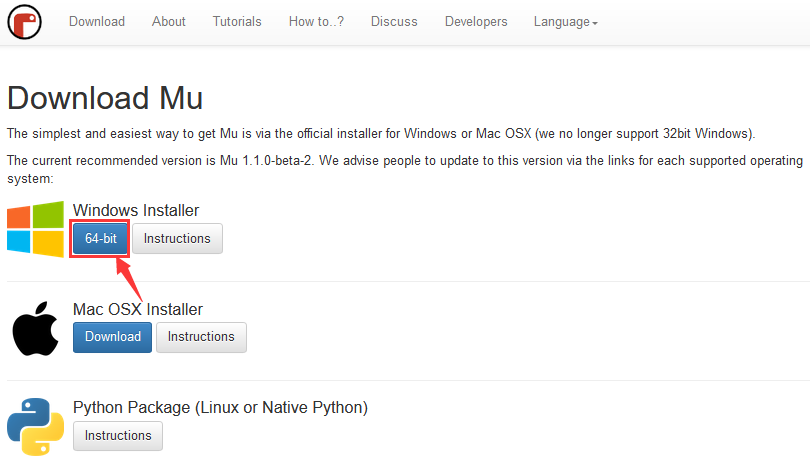
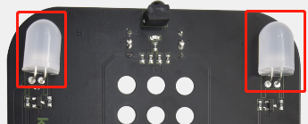
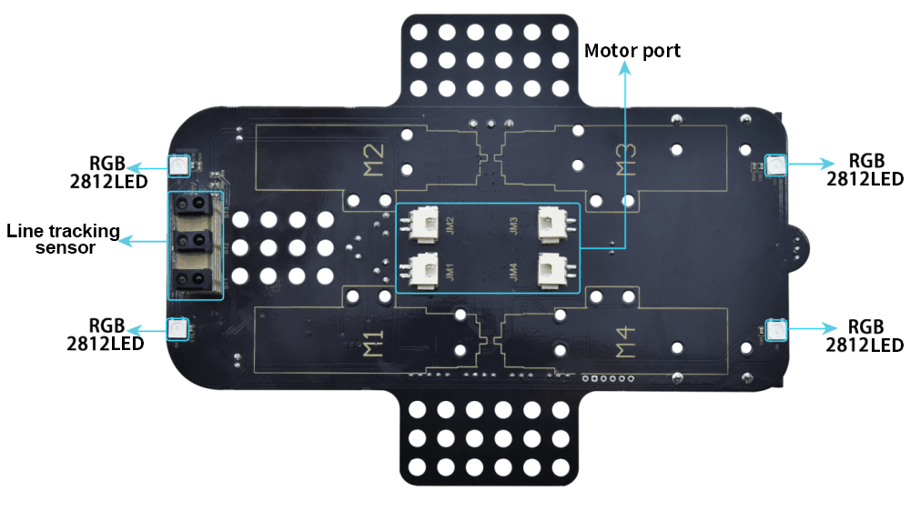
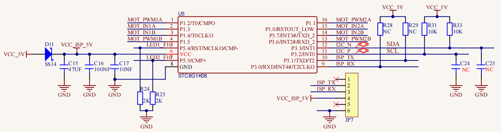

# Python Tutorial


## Getting started with Python

The Python code file is a file ending wit .py".

What is MicroPython?

Python is a text-based language, which is widely use n education and is also used by professional programmers in fields suc s data science and machine learning.

Micro: bit can be programmed in Python, which is  icrocontroller, and the hardware differences prevent micro: bit fro ully supporting Python. The MicroPython is dedicated t icro：bit，which is an efficient implementation of the Python rogramming language. It contains a small portion of the Python standar ibrary and is optimized to run on micro: bit microcontrollers.

The version of Python used by BBC micro: bit i alled MicroPython.  The MicroPython is perfect for those who want t earn more about programming, which helps you program with a series o ode snippets, a variety of pre-made graphics and music.


Python has two types of editors（web version and offline version)

1.  Web version: <https://python.microbit.org/v/1.1>


2.  The other one is the offline compiler too    -----Mu

(Download Mu：<https://codewith.mu/en/download>)

Mu

Official Website：<https://codewith.mu/>

Mu, a Python code editor, is suitable for starters.

It doesn’t support 32-bit Windows. The latest version is Mu 1.1.0-beta 2

1.  **Download Mu**

Click“This PC”and right- click to select Properties to check the versio f your computer.


Check the system type of your computer.


Enter the link: <https://codewith.mu/en/download> to download th orresponding version of Mu.



2.  **Run Setup**

Open the file below


Mac OSX：<https://codewith.mu/en/howto/1.1/install_macos>.

Windows 10

You will view the page pop-up, then click “More info”.


Then click“Run anyway”.


3. [Licens greement](C:\\Users\\NINGMEI\\AppData\\Local\\youdao\\dict\\Application\\9.0.1.1\\resultui\\html\\index.html#\\javascript:;)

Click “Install”.


After installed , click“finish”.


Start Mu

Next, find it according to the following picture


Its main interface is shown as below:


## Projects

(Note: project 1 to 12 will be conducted with the built-in sensors an ED dot matrix of the Micro:bit main board V2)

### Project 1：Heart Beat


1.  **Description**

This project is easy to conduct solely with a micro:bit main board and  icro USB cable. This experiment serves as a starter for your to entr o the magical programming world of the micro:bit.

2.  **Preparation**

A. Attach the micro:bit main board to your computer via the USB cable

B. Open the offline version of Mu.

3.  **Test Code**

Open the Mu software, click Mode, then click“BBC micro：bit”and“OK”:


Tap“Load”, select““microbit-Heartbeat.py“ file and click“open”:


|File Type|Route|File Name|
|-|-|-|
|Python file|../Python Code/8.1：Heart beat|microbit-Heart beat.py|


There is another way to import code. Open the Mu software and dra ile”microbit-Heartbeat.py”into it.


You can also input code in the edit window yourself.

(Note: All English words and symbols must be written in English.)


The following are a list of built-in images:

• Image.HEART

• Image.HEART_SMALL

• Image.HAPPY

• Image.SMILE

• Image.SAD

• Image.CONFUSED

• Image.ANGRY

• Image.ASLEEP

• Image.SURPRISED

• Image.SILLY

• Image.FABULOUS

• Image.MEH

• Image.YES

• Image.NO

• Image.CLOCK12, Image.CLOCK11, Image.CLOCK10, Image.CLOCK9 mage.CLOCK8, Image.CLOCK7, Image.CLOCK6, Image.CLOCK5,

Image.CLOCK4, Image.CLOCK3, Image.CLOCK2,Image.CLOCK1

• Image.ARROW_N, Image.ARROW_NE, Image.ARROW_E, Image.ARROW_SE mage.ARROW_S, Image.ARROW_SW, Image.ARROW_W, Image.ARROW_NW

• Image.TRIANGLE

• Image.TRIANGLE_LEFT

• Image.CHESSBOARD

• Image.DIAMOND

• Image.DIAMOND_SMALL

• Image.SQUARE

• Image.SQUARE_SMALL

• Image.RABBIT

• Image.COW

• Image.MUSIC_CROTCHET

• Image.MUSIC_QUAVER

• Image.MUSIC_QUAVERS

• Image.PITCHFORK

• Image.PACMAN

• Image.TARGET

• Image.TSHIRT

• Image.ROLLERSKATE

• Image.DUCK

• Image.HOUSE

• Image.TORTOISE

• Image.BUTTERFLY

• Image.STICKFIGURE

• Image.GHOST

• Image.SWORD

• Image.GIRAFFE

• Image.SKULL

• Image.UMBRELLA

• Image.SNAKE，Image.ALL_CLOCKS，Image.ALL_ARROWS

Connect the micro:bit board to computer via an USB cable, click“Flash”t ownload code to the board.


<


The code, even it is wrong, can be downloaded to the micro:bit boar uccessfully, but can not work on micro:bit board.

Click“Flash”to download code to micro:bit.


Click“REPL”and press the reset button on micro:bit, the erro nformation will be displayed on the REPL window, as shown below:


Click“REPL”again to turn off the REPL mode, then you could refresh ne ode.

To make sure the correct code, you only need to tap“Check”. The error ill be shown on the window.


Modify the code according to the prompt and click“Check”.


Please log in the website for mor utorials：<https://codewith.mu/en/tutorials/>

4.  **Test Result**

After uploading the test code successfully, clicking“Flash”button an eeping the connection with the computer to power the main board, the he LED dot matrix shows the pattern “❤”and then
“”alternatively.

5.  **Code Explanation**


|from microbit import*|Import the library file of micro：bit|
|-|-|-|
|while True:|This is a permanent loop that makes micro:bit execute the code i his loop forever. .|
|display.show(Image.HEART)|micro：bit shows “❤”|
|sleep(500)|Delay in 500ms|
|display.show(Image.HEART_SMALL)|The LED dot matrix displays“”|


### Project 2：Light A Single LED


1.  **Description**

The LED dot matrix consists of 25 Diodes arranged in a 5 by 5 square an laced at the intersection of row lines (X) and column lines (Y). We ca ontrol one of the 25 LEDs by setting coordinate points. For example he first LED sits in the first line is (0,0）and the third LE ositioned in the first line is (2,0）and others likewise.


2.  **Preparation**

A. Attach the micro:bit main board to your computer via the USB cable

B. Open the offline version of Mu.

3.  **Test Code**

Enter the Mu software and open the“Single LED display.py.”file to impor ode:


|Type|Route|File Name|
|-|-|-|
|Python file|../Python code/8.2：<mark>Light up an LED</mark>|microbit<mark>-Light up an LED</mark> .py|


You can also input code in the editing window yourself.

(Note: All English words and symbols must be written in English)


Click“Check”to examine error in the code. The program proves wrong i nderlines and cursors are shown.


If the code is correct, connect the micro:bit to your computer an lick“Flash”to download code to micro:bit board.


4.  **Test Result**

After uploading the test code to the micro:bi ain board and powering the board via an USB cable, then the LED i 1,0) will be on and off for 0.5s and the one in (3,4) will be on an ff for 0.5s and repeat this sequence.

5.  **Code Explanation**

```python
from microbit import *

val1 = Image("09000:""00000:""00000:""00000:""00000:")
val2 = Image("00000:""00000:""00000:""00000:""00090:")
val3 = Image("00000:""00000:""00000:""00000:""00000:")

while True:
    display.show(val1)
    sleep(500)
    display.show(val3)
    sleep(500)
    display.show(val2)
    sleep(500)
    display.show(val3)
    sleep(500)


```


6.  **Reference**

sleep(ms) : delay time

For more details about delay, please refer to th ink:
[https://microbit-micropython.readthedocs.io/en/latest/utime.html](E:\\readthedocs keyestudio\\pandoc\\KS4034 Keyestudio micro bit 4WD Mecanum Robot Car Kit V2.0\\docs\\3. Python Tutorial\\ https:\\microbit-micropython.readthedocs.io\\en\\latest\\utime.html)

### Project 3：5\ 5 LED Dot Matrix


1.  **Description**

Dot matrix is very commonplace in daily life, which has found wid pplications in LED advertisement screens, elevator floor display, bu top announcement and so on.

The LED dot matrix of Micro: Bit main board contains 25 Diodes reviously, we have succeeded in controlling a certain LED via it osition point. Supported by the same theory, we can turn on many LED t the same time to showcase patterns, digits and characters.

What’s more, we can also click”show icon“ to choose the pattern we lik o display. Last but not the least, we can design patterns by ourselve s well.

2.  **Preparation**

A. Attach the micro:bit main board to your computer via the USB cable

B. Open the offline version of Mu.

3.  **Test Code**

Test Code1：

You could open“5×5 LED Dot Matrix-1.py“file t mport the code（[How to load the project code?](\l)）


|File Type|Route|File Name|
|-|-|-|
|Python file|../Python code/8.3：<mark>5×5 LED Dot Matrix</mark>|microbit-<mark>5× 5 LED Dot Matrix</mark>-1.py|


You can also input code in the editing window yourself.

(Note: All words and symbols must be written in English.)


Click“Check”to examine the error in the code. The program proves wron f underlines and cursors are shown.


If the code is correct, connect micro:bit to computer and click“Flash”t ownload code to micro:bit board.


Test Code 2：

You could open “5×5 LED Dot Matrix-2.py“ fil o import the code（[How to load the project code?](\l)）


|File Type|Route|File Name|
|-|-|-|
|Python file|../Python code/8.3：5×5 LED Dot Matrix|microbit-5×5 LED Dot Matrix-2.py|


You can also input code in the editing window yourself.

(Note: All words and symbols must be written in English.)


Click“Check”to examine errors in the code. The program proves wrong i nderlines and cursors are shown.


If the code is correct, connect the micro:bit to the computer an lick“Flash”to download code to micro:bit board.


4.  **Test Result**

After uploading the test code 1 to the
micro:bit main board and powering the main board via the USB cable, w ill find that the 5\*5 dot matrix start to show a downward arrow
.

After uploading the test code 2 to the
micro:bit main board, we will find that the 5\*5 dot matrix start t how numbers 1,2,3,4 and 5 and then it alternatively shows a downwar rro ord,
“Hello”, a heart pattern
, a rrow pointing at northeast
, then at southeast
 hen at southwest
 nd then at northwest
.

5.  **Code Explanation**

1
```python
from microbit import *

val = Image("00900:""00900:""90909:""09990:""00900")

display.show(val)

```


2
```python
from microbit import *
val = Image("00900:""00900:""90909:""09990:""00900")
display.show('1')
sleep(500)
display.show('2')
sleep(500)
display.show('3')
sleep(500)
display.show('4')
sleep(500)
display.show('5')
sleep(500)
display.show(val)
sleep(500)
display.scroll("hello!")
sleep(200)
display.show(Image.HEART)
sleep(500)
display.show(Image.ARROW_NE)
sleep(500)
display.show(Image.ARROW_SE)
sleep(500)
display.show(Image.ARROW_SW)
sleep(500)
display.show(Image.ARROW_NW)
sleep(500)
display.clear()

```


6.  **Reference**

display.scroll() ：

The display scrolls to show the values, if it is integer or float, w ill use str（）to transfer it into character strings.

More details, please refer to th ink：<https://microbit-micropython.readthedocs.io/en/latest/utime.html>

### Project 4：Programmable Buttons


1.  **Description**

Button an be used to control circuits. In an integrated circuit with a pus utton, the circuit is connected when pressing the button and but afte elease, it will break again. 

Both ends of the button like two mountains. There is a river in between.

The internal metal piece connect the two sides to let the current pass ust like building a bridge to connect two mountains.

The internal structure of the button is shown as follows: befor ressing the button, 1 ,2 , 3 and 4 are turned on. However, 1, 3 or 1,  r 2, 3 or 2 and 4 are disconnected, which is only enabled when th utton i ressed. 

Micro: Bit main board boasts three push buttons, two are programmabl uttons(marked with A and B), and the one on the other side is a rese utton. By pressing the two programmable buttons can input thre ifferent signals. We can press button A or B alone or press the ogether and the LED dot matrix shows A,B and AB respectively. Let’s ge tarted.

2.  **Preparation**

A. Attach the micro:bit main board to your computer via the USB cable

B. Open the offline version of Mu.

3.  **Test Code**

Test Code 1：

Enter Mu software and open the file“Projec ：Programmable Buttons-1.py”to import th ode:

（[How to load the project code?](\l)）


|File Type|Route|File Name|
|-|-|-|
|Python file|../Python code/8.4：<mark>Programmable Buttons</mark>|microbit-<mark>Programmable Buttons-</mark>1.py|


You can also input code in the editing window yourself.

(Note: All words and symbols must be written in English.)


Click“Check”to examine errors in the code. The program proves wrong i nderlines and cursors are shown.


If the code is correct, connect the micro:bit to your computer an lick“Flash”to download the code to the micro:bit board.


Test Code 2：

Enter Mu software and open the file“Projec ：Programmable Buttons-2.py”to import th ode:

（[How to load the project code?](\l)）


|File Type|Route|File Name|
|-|-|-|
|Python file|../Projects/8.4：<mark>Programmable Buttons</mark>|microbit- <mark>Programmable Buttons-</mark>2.py|


You can also input code in the editing window yourself.

(Note: All words and symbols must be written in English.)


Click“Check”to examine errors in the code. The program proves wrong i nderlines and cursors are shown.


If the code is correct, connect the micro:bit to your computer an lick“Flash”to download the code to the micro:bit board.


4.  **Test Result**

After uploading the test code1 to the
micro:bit main board and powering the board via the USB cable, the 5\* ED dot matrix shows “A”if button A is pressed, then“B” if button B i ressed, and “AB” if button A and B are pressed together.

After uploading the test code 2 to the
micro:bit main board and powering the board via the USB cable, if th utton A is pressed, the LEDs turning red increase while if the button  ressed, the LEDs turning red reduce.

5.  **Code Explanation**


1
```python
from microbit import *
a = 0
b = 0
val1 = Image("00000:""00000:""00000:""00000:""00900")
val2 = Image("00000:""00000:""00000:""00900:""99999")
val3 = Image("00000:""00000:""00900:""99999:""99999")
val4 = Image("00000:""00900:""99999:""99999:""99999")
val5 = Image("00900:""99999:""99999:""99999:""99999")
val6 = Image("99999:""99999:""99999:""99999:""99999")
display.show(val1)

while True:
    while button_a.is_pressed() == True:
        sleep(10)
        if button_a.is_pressed() == False:
            a = a + 1
            if(a >= 5):
                a = 5
            break
    while button_b.is_pressed() == True:
        sleep(10)
        if button_b.is_pressed() == False:
            a = a - 1
            if(a <= 0):
                a = 0
            break
    if a == 0:
        display.show(val1)
    if a == 1:
        display.show(val2)
    if a == 2:
        display.show(val3)
    if a == 3:
        display.show(val4)
    if a == 4:
        display.show(val5)
    if a == 5:
        display.show(val6)

```


2
```python
from microbit import *

while True:
    if button_a.is_pressed():
        display.show("A")
    elif button_a.is_pressed() and button_b.is_pressed():
        display.scroll("AB")
    elif button_b.is_pressed():
        display.show("B")

```


### Project 5：Temperature Detection

1.  **Description**

The Micro:bit main board is not equipped with a temperature sensor, bu ses the built-in temperature sensor in NFR52833 chip for temperatur etection. Therefore, the detected temperature is more closer to th emperature of the chip, and there maybe deviation from the ambien emperature.

In this project, we will seek to use the sensor to test the temperatur n the current environment, and display the test results in the displa ata (device). And then control the LED dot matrix to display differen atterns by setting the temperature range detected by the sensor.

Note: the temperature sensor of Micro:bit main board is shown below:


2.  **Preparation**

A. Attach the micro:bit main board to your computer via the USB cable

B. Open the offline version of Mu.

3.  **Test Code**

Test Code 1：

Enter Mu software and open the file“Projec ：Temperature Measurement -1.py “ to impor ode:


|File Type|Route|File Name|
|-|-|-|
|Python file|../Python code/8.5：<mark>Temperature Measurement</mark>|micro<mark>bit- Temperature Measurement -1.py</mark>|


You can also input code in the editing window yourself.

(Note: All words and symbols must be written in English.)


Click“Check”to examine error in the code. The program proves wrong i nderlines and cursors are shown.


If the code is correct, connect micro:bit to computer and click“Flash”t ownload code to micro:bit board.


After downloading the test code 1 to the micro:bit board, keep US onnected and click“REPL”and press the reset button on micro:bit. The EPL window will show the ambient temperature value, as shown below: (  tands for temperature unit)


Test Code 2:

Enter Mu software and open the file“Projec ：Temperature Measurement -2.py”to impor ode:


|File Type|Route|File Name|
|-|-|-|
|Python file|../Python code/8.5：<mark>Temperature Measurement</mark>|microbi<mark>t- Temperature Measurement</mark> -2.py|


You can also input code in the editing window yourself.

(Note: All words and symbols must be written in English.)

The temperature value can be set in compliance with the rea emperature.


Click“Check”to examine error in the code. The program proves wrong i nderlines and cursors are shown.


If the code is correct, connect the micro:bit to the computer an lick“Flash”to download the code to the micro:bit board.


4.  **Test Result**

After uploading the code 2 to the board, when the ambient temperature i ess than 35℃, the 5\*5 LED dot matrix shows
 hen the temperature is equivalent to or greater than 35℃, th attern
appears.

5.  **Code Explanation**

1
```python
from microbit import *

while True:

    Temperature = temperature()

    print("Temperature:", Temperature, "C")

    sleep(500)


```


2
```python
from microbit import *

while True:

    if temperature() >= 35:
        display.show(Image.HEART)

    else:
        display.show(Image.HEART_SMALL)


```


### Project 6：Geomagnetic Sensor


1.  **Description**

This project mainly introduces the use of the micro:bit’ eomagnetic sensor. In addition to detecting the strength of th agnetic field, it can also be used to determine the direction, which i n important part of the heading and attitude reference system (AHRS) a ell.

It uses FreescaleMAG3110 three-axis magnetometer. Its I2C interfac ommunicates with the outside, and the range is ±1000µT, the maximu ata update rate is 80Hz. Combined with an accelerometer, it ca alculate the position. Additionally, it is applied to magneti etection and compass blocks.

Then we could read the value detected by it to determine the location e need to calibrate the micro:bit board when the magnetic sensor works he correct calibration method is to rotate the micro:bit board.

In addition, the objects nearby may affect the accuracy of readings an alibration.

2.  **Preparation**

A. Attach the micro:bit main board to your computer via the USB cable

B. Open the offline version of Mu.

3.  **Test Code**

Test Code 1：

Enter Mu software and open the file“Projec ：Magnetic sensor -1.py“ to import code:


|File Type|Route|File Name|
|---------|-----|---------|
|Python file|../Python code/8.6：<mark>Magnetic sensor</mark>|microbit-<mark>Magnetic sensor -1</mark>.py|


You can also input the code in the editing window yourself.

(Note: All words and symbols must be written in English.)


Click“Check”to examine errors in the code. The program proves wrong i nderlines and cursors are shown.


If the code is correct, connect micro:bit to the computer an lick“Flash”to download the code to the micro:bit board.


After uploading the test code1 to the
micro:bit main board and powering the board via an USB cable, an ressing the button A, the board asks us to calibrate the compass an he LED dot matrix shows “TILT TO FILL SCREEN”. Then enter th alibration page. Rotate the board until all 25 red LEDs are on, a hown below.


After that, a smile pattern
 appears, which implies the calibration is done. Whe he calibration process is completed, pressing the button A will mak he magnetometer reading display directly on the screen. And th irection north, east, south and west correspond to 0°, 90°, 180° an 70° respectively.

Test Code 2:

For the below picture, the arrow will work to point to the upper righ hen the value ranges from 292.5 to 337.5. Since 0.5 can’t be input i he code, the values we get are 293 and 338.

Then add other statements to make a set of complete code.


Enter Mu software and open the file“Projec ：Magnetic sensor -2.py“ to import the code:


|File Type|Route|File Name|
|-|-|-|
|Python file|../Python code/8.6：<mark>Magnetic sensor</mark>|microbit-<mark>Magnetic sensor -</mark>2.py|


You can also input code in the editing window yourself.

(Note: All words and symbols must be written in English.)


Click“Check”to examine errors in the code. The program proves wrong i nderlines and cursors are shown.


If the code is correct, connect the micro:bit to your computer an lick“Flash”to download the code to the micro:bit board.


4.  **Test Result**

Upload the code 2 and plug the micro:bit into power. After calibration otate the micro:bit board, then the LED dot matrix displays th irection signs.

5.  **Code Explanation**

1
```python
from microbit import *

while True:
    gesture = accelerometer.current_gesture()

    if gesture == "shake":
        display.show("1")
    if gesture == "up":
        display.show("2")
    if gesture == "down":
        display.show("3")
    if gesture == "face up":
        display.show("4")
    if gesture == "face down":
        display.show("5")
    if gesture == "left":
        display.show("6")
    if gesture == "right":
        display.show("7")
    if gesture == "freefall":
        display.show("8")

```

2
```python
from microbit import *

while True:

    x = accelerometer.get_x()

    y = accelerometer.get_y()

    z = accelerometer.get_z()

    print("x, y, z:", x, y, z)

    sleep(100)

```


### Project 7：Accelerometer


1.  **Description**

The micro: bit main board V2 has a built-in LSM303AGR gravit cceleration sensor, also known as accelerometer, with a resolution o /10/12 bits. The code section sets the range to 1g g, 4g, and 8g.

We often use an accelerometer to detect the status of machines.

In this project, we will work to introduce how to measure the positio f the board with the accelerometer. And then have a look at th riginal three-axis data output by the accelerometer.

2.  **Preparation**

A. Attach the micro:bit main board to your computer via the USB cable

B. Open the offline version of Mu.

3.  **Test Code**

Test Code 1：

Enter Mu software and open the file“Projec ：Three-axis acceleration sensor -1.py“ t mport the code:

（[How to load the project code?](\l)）


|File Type|Route|File Name|
|-|-|-|
|Python file|../Python code/8.<mark>7：Three-axis acceleration sensor</mark>|microbit-<mark>Three-axis acceleration sensor -1.p</mark>y|


You can also input the code in the editing window yourself.

(Note: All words and symbols must be written in English.)


Click“Check”to examine errors in the code. The program proves wrong i nderlines and cursors are shown.


If the code is correct, connect the micro:bit to your computer an lick“Flash”to download the code to the micro:bit board.


Test Code 2：

Enter Mu software and open the file“Projec ：Three-axis acceleration sensor -2.py“ t mport the code:

（[How to load the project code?](\l)）


|File Type|Route|File Name|
|-|-|-|
|Python file|../Python code/8.7<mark>：Three-axis acceleration sensor</mark>|microb<mark>it-Three-axis acceleration sensor -2.py</mark>|


You can also input the code in the editing window yourself.

(Note: All words and symbols must be written in English.)


Click“Check”to examine errors in the code. The program proves wrong i nderlines and cursors are shown.


If the code is correct, connect the micro:bit to your computer an lick“Flash”to download the code to the micro:bit board.


After referring to the MMA8653FC data manual and the hardware schemati iagram of the micro: bit main board, the accelerometer coordinate o he micro: bit is shown in the figure below:


Upload the test code 2 to the micro:bit mai oard and power the board via the USB cable.
Click“REPL”and press the reset button. The value o he acceleration on X axis, Y axis and Z axis are shown below:


4.  **Test Result**

After uploading the test code 1 to the
micro:bit main board and powering the board via the USB cable, when w hake the micro: bit main board，no matter at any direction, the LED do atrix displays the digit “1”.

When it is kept upright（make its logo above the LED dot matrix）, th umber 2 appears.


When it is kept upside down( make its logo below the LED dot matrix)  t shows as below.


When it is placed still on the desk, showing its front side, the numbe  appears.


When it is placed still on the desk, showing its back side, the number  xhibits.

When the board is tilted to the left , the LED dot matrix shows th umber 6, as shown below:


When the board is tilted to the right , the LED dot matrix displays th umber 7, as shown below：


When the board is knocked to the floor, this process can be considere s a free fall and the LED dot matrix shows the number 8. (Please not hat this test is not recommended for it may damage the main board.)

Attention: If you’d like to try this function, you can also set th cceleration to 3g, 6g or 8g.

5.  **Code Explanation**

1
```python
from microbit import *

while True:
    gesture = accelerometer.current_gesture()

    if gesture == "shake":
        display.show("1")
    if gesture == "up":
        display.show("2")
    if gesture == "down":
        display.show("3")
    if gesture == "face up":
        display.show("4")
    if gesture == "face down":
        display.show("5")
    if gesture == "left":
        display.show("6")
    if gesture == "right":
        display.show("7")
    if gesture == "freefall":
        display.show("8")

```

2
```python
from microbit import *

while True:

    x = accelerometer.get_x()

    y = accelerometer.get_y()

    z = accelerometer.get_z()

    print("x, y, z:", x, y, z)

    sleep(100)

```


### Project 8：Light Detection


1.  **Description**

In this project, we will focus on the light detection function of th icro: Bit main board. It is achieved by the LED dot matrix since th ain board is not equipped with a photoresistor.

2.  **Preparation**

A. Attach the micro:bit main board to your computer via the USB cable

B. Open the offline version of Mu.

3.  **Test Code**

Enter Mu software and open the file“project 8：Light Detection.py”t mport the code


|File Type|Route|File Name|
|-|-|-|
|Python file|<mark>../Python code/8.8：Detect Light Intensity b icro:bit</mark>|<mark>microbit-Detect Light Intensity by Micro:bit .py</mark>|


You can also input code in the edit window yourself.

(Note: All English words and symbols must be written in English.)


Click“Check”to examine errors in the code. The program proves wrong i nderlines and cursors are shown.


If the code is correct, connect the micro:bit to your computer an lick“Flash”to download code to the micro:bit board.


4.  **Test Result**

cable don’t plug of t. Click “REPL”and press the reset buttons, the light intensity valu ill be displayed, as shown below.

When the LED dot matrix is covered by hand, the ligh ntensity showed is approximately 0; when the LED dot matrix i xposed to light, the light intensity displayed gets stronger with th ight.


5.  **Code Explanation**


```python
from microbit import *

while True:

    Lightintensity = display.read_light_level()

    print("Light intensity:", Lightintensity)

    sleep(100)

```


### Project 9：Speaker


1.  **Description**

Micro: Bit main board has an built-in speaker, which makes adding soun o the programs easier. It can also be programmed to produce all kind f tones, like playing the song *Ode to Joy.*

2.  **Preparation**

A. Attach the micro:bit main board to your computer via the USB cable

B. Open the offline version of Mu.

3.  **Test Code**

Enter Mu software and open the file“Project 9：Speaker.py”to impor ode:（[How to load the project code?](\l)）


|File Type|Route|File Name|
|-|-|-|
|Python file|<mark>../Python code/8.9：Speaker</mark>|<mark>microbit-Speaker.py</mark>|


You can also input code in the editing window yourself.

(Note: All words and symbols must be written in English.)


Click“Check”to examine errors in the code. The program proves wrong i nderlines and cursors are shown.


If the code is correct, connect the micro:bit to your computer an lick“Flash”to download the code to the micro:bit board.


4.  **Test Result**

After uploading the test code to the micro:bi ain board and powering it via the USB cable, the speaker utters soun nd the LED dot matrix shows the logo of music.

5.  **Code Explanation**


```python
from microbit import *

import audio

display.show(Image.MUSIC_QUAVER)

while True:
    audio.play(Sound.GIGGLE)
    sleep(1000)
    audio.play(Sound.HAPPY)
    sleep(1000)
    audio.play(Sound.HELLO)
    sleep(1000)
    audio.play(Sound.YAWN)
    sleep(1000)

```


### Project 10: Touch-sensitive Logo


1.  **Description**

The Micro: Bit main board V2 is equipped with a golden touch-sensitiv ogo, which can act as an input component like an button.

It contains a capacitive touch sensor that senses small changes in th lectric field when pressed (or touched), just like your phone or table creen. When you press it , the program can be activated.

2.  **Preparation**

A. Attach the micro:bit main board to your computer via the USB cable

B. Open the offline version of Mu.

3.  **Test Code**

Enter Mu software and open the file“Project 10：Touch-sensitiv ogo.py”to import code:（[How to load the project code?](\l)）


|File Type|Route|File Name|
|-|-|-|
|Python file|<mark>../Python code/8.10：</mark>Touch Sensitive Logo|<mark>microbit-</mark>Touch Sensitive Logo<mark>.py</mark>|


You can also input code in the edit window yourself.

(Note: All English words and symbols must be written in English.)


How Micro:bit works?

1.  The runtime is recorded in milliseconds(ms) .

2.  When you press button A, a variable named start will be set to th    current running time.

3.  When you press button B, the start time will be subtracted from th    new running time to calculate the passed time since you started th    stopwatch. This difference is added to the total time, which i    stored in a variable named time.

4.  If you press the golden logo, the program will display the tota    elapsed time on the LED display. It converts time from millisecond    (thousandths of a second) to seconds by dividing by 1000. It use    the integer division operator to give an integer (integer) result.

5.  The program is also controlled by a Boolean variable named running    Boolean variable only has two values: true or false. If "running" i    "true", it means that the stopwatch has started. If "running" i    false, it means that the stopwatch has not started or has stopped.

6.  If "running" is true, the beating heart pattern will be displayed o    the LED dot matrix screen.

7.  \(7\) If the stopwatch has stopped and the "running" is false, whe    you press the golden logo, it will only display the time.

8.  If the stopwatch has been started and"running" is true, it only nee    to ensure that the time variable will change when button B i    pressed, and the code can also prevent false readings.

Click“Check”to examine errors in the code. The program proves wrong i nderlines and cursors are shown.


If the code is correct, connect the micro:bit to your computer an lick“Flash”to download code to the micro:bit board.


4.  **Test Result**

via the USB cable, then pres utton A to start the stopwatch. When timing, the beating heart patter ill be displayed on the LED dot matrix screen. Press button B to sto t and you can start and stop it at any time.

It will keep recording time, just like a rea topwatch. Press the golden logo in the front of the micro:bit t isplay the measured time in seconds. And the time can be reset to zer y pressing the reset button on the back of it.

### Project 11: Microphone


1.  **Description**

The Micro: Bit main board has a built-in microphone, which can test th olume of ambient environment. When you clap, the microphone LE ndicator turns on. Furthermore, it can measure the intensity of sound hereby you can make a noise scale or disco lighting changing wit usic.

The microphone is placed on the opposite side of the microphone LE ndicator and in proximity with holes that lets sound pass. When th oard detects the sound, the LED indicator lights up.

2.  **Preparation**

A. Attach the micro:bit main board to your computer via the USB cable

B. Open the offline version of Mu.

3.  **Test Code**

Test Code 1：

Enter Mu software and open the file“ Project 11：Microphone-1.py”t mport the code:（[How to load the project code?](\l)）


|File Type|Route|File Name|
|-|-|-|
|Python file|<mark>../Python code/8.11：</mark>Microphone <mark></mark>|<mark>microbit-</mark>Microphone-1<mark>.py</mark>|


You can also input code in the editing window yourself.

(Note: All words and symbols must be written in English.)


Click“Check”to examine errors in the code. The program proves wrong i nderlines and cursors are shown.


If the code is correct, connect the micro:bit to your computer an lick“Flash”to download code to the micro:bit board.


After uploading the test code1 to the
micro:bit main board and powering it via the USB cable, the LED do atrix displays the pattern “❤”when you cla nd the pattern

when it is quiet around.

Test Code2：

Enter Mu software and open the file“Project 11：Microphone-2.py”t mport the code:（[How to load the project code?](\l)）


|File Type|Route|File Name|
|-|-|-|
|Python file|../Python code/<mark>8.11：</mark>Microphone <mark></mark>|microbi<mark>t-</mark> Microphone <mark></mark>-2.py|


You can also input code in the editing window yourself.

(Note: All words and symbols must be written in English.)


Click“Check”to examine errors in the code. The program proves wrong i nderlines and cursors are shown.


If the code is correct, connect the micro:bit to your computer an lick“Flash”to download code to the micro:bit board.


4.  **Test Result**

Upload the test code to the micro:bit mai oard and power it via the USB cable. When the button A is pressed, th ED dot matrix displays the value of the biggest volume( please not hat the biggest volume can be reset via the Reset button on the othe ide of the board ). When clapping, the louder the tested sound, th righter the 25 LEDs on the LED dot matrix screen.

5.  **Code Explanation**


|<strong>from</strong> microbit <strong>import</strong> *|Import the library of micro：bit|
|-|-|-|
|<strong>while True:</strong>|This is a permanent loop that makes micro:bit execute the code o t.|
|-|-|-|
|<p><strong>if</strong> microphone.current_event() ==
SoundEvent.LOUD:</p>
<p>display.show(Image.HEART)</p>
<p>sleep(200)</p>
<p><strong>if</strong> microphone.current_event() ==
SoundEvent.QUIET:</p>
<p>display.show(Image.HEART_SMALL)</p>|<p>If there is a sound</p>
<p>LED shows ❤</p>
<p>Delay in 200ms</p>
<p>if no sound is detected</p>
<p>LED lights show </p>|
|-|-|-|
|print("Light intensity:", Lightintensity)|BBC microbit REPL prints the detected light intensity value|
|-|-|-|
|maxSound = 0|The initial value of maxSound is 0|
|-|-|-|
|lights = Image("11111:""11111:""11111:""11111:""11111")|Assign Image() to variable lights|
|-|-|-|
|soundLevel = microphone.sound_level()|Assign microphone.sound_level() to the variable soundLevel|
|-|-|-|
|<p><strong>if</strong> button_a.is_pressed():</p>
<p>display.scroll(maxSound)</p>
<p><strong>else:</strong></p>
<p>soundLevel = microphone.sound_level()</p>
<p>display.show(lights * soundLevel)</p>
<p><strong>if</strong> soundLevel &gt; maxSound:</p>
<p>maxSound = soundLevel</p>|<p>if the button A is pressed</p>
<p>LED lights show the sound value</p>
<p>If not</p>
<p>Assign microphone.sound_level() to the variable soundLevel</p>
<p>As the sound changes，the micro:bit will display the breathing ligh ffect</p>
<p>If the sound value is higher than its maximum value</p>
<p>the maximum sound value is equal to sound level value</p>|


### Project 12: Control Speaker

1.  **Description**

In the previous projects, we have learned about the touch-sensitive log nd the speaker respectively. In the project, we will combine these tw omponents to play music.

2.  **Components Needed**


|||
|-|-|-|
|Micro:bit main board \*1|USB cable\*1|


3.  **Wiring Diagram**

Attach the Micro:bit main board to your computer via th SB cable.

4.  **Test Code**

Enter Mu software and open the file“Project 12：Control Speaker.py”t mport code:

（[How to load the project code?](\l)）


|File Type|Route|File Name|
|-|-|-|
|Python file|<mark>../Python code/8.12：Touch-sensitive Logo Controlle peaker</mark>|<mark>Touch the Logo to control the speaker.py</mark>|


You can also input code in the editing window yourself.

(Note: All words and symbols must be written in English.)


Click“Check”to examine errors in the code. The program proves wrong i nderlines and cursors are shown.


If the code is correct, connect the micro:bit to your computer an lick“Flash”to download the code to the micro:bit board.


5.  **Test Result**

After uploading the test code to the micro:bi ain board and powering it via the USB cable, the speaker plays the song
“*Happy Birthday to You”* when the logo is touched.

6.  **Code Explanation**

```python
from microbit import *

import music

display.show(Image.MUSIC_QUAVER)

while True:

    if pin_logo.is_touched():
        music.play(music.BIRTHDAY)

```
Bluetooth Wireless Communication

The micro:bit owns a low-consumption Bluetooth module to communicate bu ith 16k RAM. However, BLE heap stack occupies 12K RAM, thereby there i o enough space to run microPython.

At present, microPython doesn’t support the Bluetooth service.

<https://microbit-micropython.readthedocs.io/en/latest/ble.html>

The former projects are the introduction of sensors and modules. Th urther lessons are challenging for new starters.

(Note: In order to refrain the micro:bit board fro eing burned, disconnect the micro USB cable from it and turn off th ower on the micro:bit motor driver base plate before installing it o he car expansion board and dial the POWER switch to the OFF end ikewise, before removing the the main board from the car expansio oard, disconnect the micro USB cable from it and turn off the power o he micro:bit motor driver base plate.

### Project 13: Seven-Color LED

\\

1.  **Description**

This module consists of a commonly used LED with 7colors but in whit ppearance. It can automatically flash different colors to creat antastic light effects when high level is input like a normal LED.

2.  **Preparation**

- Insert the micro:bit board into the slot of keyestudi  4WD Mecanum Robot Car V2.0

- Place batteries into battery holder

- Dial power switch to ON end

- Connect the micro:bit to your computer via an USB cable

- Open the offline version of Mu.

3.  **Test Code**

Enter Mu software and open the file“Project 13：Seven-Color LED t mport code:

（[How to load the project code?](\l)）


|File Type|Route|File Name|
|-|-|-|
|Python file|<mark>../Python code/8.13：Colorful lights</mark>|microbit-<mark>Colorful lights.py</mark>|


You can also input code in the editing window yourself.

(Note: All words and symbols must be written in English.)


Don't click "Flash", but import the "keyes_mecanum_Car_V2.py" librar ile into the micro:bit. This file contains the control method of th icro:bit Mini Smart Mecanum Wheel Smart Car.

Import the "keyes_mecanum_Car_V2.py" file.

The default directory for Mu files is "Mu_code", which is located in th oot directory of the user directory. Reference link:
<https://codewith.mu/en/tutorials/1.0/files>

For example, on the windows system, suppose your system is installed o he C driver of the computer, and the user name is "Administrator", the he path of the "mu_code" directory is "C:\Users\Administrator\mu\_
code". On Linux systems, the path of the "mu_code" directory i ~/home/mu_code".

Enter the “mu_code”folder.


Copy“keyes_mecanum_Car.py“library file to the folder”mu_code“ and th ath is below :


|File type|Path|File name|
|-|-|-|
|Python file|../PythonCode/LibrariesmecanumCar_python_Libraries|keyes_mecanum_Car_V2.py|


When the copy is done, as shown below:


First open the Mu software and connect the micro:bit to your computer hen click the "Files" button, and drag the "keyes_mecanum_Car.py ibrary file to the micro:bit.


After a few seconds, the import is complete and you can see it in th ox on the left.


After the library file is imported successfully, you also need to clic he "Check" button to check the code. If a cursor or an underlin ppears on a certain line, then errors appear in the program.


However, during this process, the following prompt will appear even i here is no error in the code. These prompts are just warnings not th ode error prompts.


If the code is correct, connect the micro:bit to your computer an lick“Flash”to download the code to the micro:bit board.


If errors appear after clicking the "Flash" button, please confir hether you have imported the provided "keyes_mecanum_Car_V2.py" librar ile.

Note:

Before programming with Micropython, you need to import th keyes_mecanum_Car_V2.py" library file to the micro:bit. If you progra ith different micro:bit, the library file"keyes_mecanum_Car_V2.py eeds to be imported again to a new micro:bit.

4. Test Result

Download the code to the micro:bit board and dial POWER switch to O nd, then the seven-color LED will flash in 3s and then stop in 3s an epeat this pattern.

5. Code Explanation


```python
from microbit import *
from keyes_mecanum_Car_V2 import *

mecanumCar = Mecanum_Car_Driver_V2()

while True:
    mecanumCar.left_led(1)
    mecanumCar.right_led(1)
    sleep(3000)
    mecanumCar.left_led(0)
    mecanumCar.right_led(0)
    sleep(3000)

```


### Project 14: 4 WS2812 RGB LEDs


1.  **Description**

The driver shield cooperates 4 pcs WS2812 RGB LEDs, compatible wit icro:bit board and controlled by P7. In this lesson, we will make th GB LEDs display different colors by P7. In this lesson, 3 sets of tes ode are provided to make the 4 WS2812 RGB LEDs display differen ffects.


|Sample|Color|RGB Value（R,G,B）|Color Code(16 colors)|Sample|Color|RGB Value（R,G,B）|Color Code(16 colors)）|
|-|-|-|-|-|-|-|-|
||Red|255, 0, 0|#FF0000||Orange|255, 165, 0|#FFA500|
||Yellow|255, 255, 0|#FFFF00||Green|0, 255, 0|#00FF00|
||Blue|0, 255, 0|#0000FF||Indigo|75, 0, 130|#4B0082|
||Violet|238, 130, 238|#EE82EE||Purple|160, 32, 240|#A020F0|
||Black|0, 0, 0|#000000||White|255, 255, 255|#FFFFFF|
|......|......|.......|......|......|......|......|......|
|Change |the |value of the| R,G and B |to| get |differen |olors|


2.  **Preparation**

- Insert micro:bit board into the slot of keyestudi  4WD Mecanum Robot CarV2.0

- Place batteries into battery holder

- Dial power switch to ON end

- Connect the micro:bit to your computer via an USB cable

- Open the offline version of Mu.

3.  **Test Code**

Code1:

Enter Mu software and open the file“Project 14：4 WS2812 RG EDs-1.py”to import code:

（[How to load the project code?](\l)）


|File Type|Route|File Name|
|-|-|-|
|Python file|<mark>../Python code/8.14：</mark>WS2812 RGB lights|microbit-4 WS2812 RGB lights-1.py|


You can also input code in the edit window yourself.

(Note: All English words and symbols must be written in English.)

Click“Check”to examine errors in the code. The program proves wrong i nderlines and cursors are shown.


If the code is correct, connect the micro:bit to your computer an lick“Flash”to download the code to the micro:bit board.


Code 2:

Enter Mu software and open the file“Project 14：4 WS2812 RG EDs-2.py”to import code:

（[How to load the project code?](\l)）


|File Type|Route|File Name|
|-|-|-|
|Python file|<mark>../Python code/8.14：</mark>WS2812 RGB lights|microbit-4 WS2812 RGB lights-1.py|


You can also input code in the edit window yourself.

(Note: All English words and symbols must be written in English.)

Click“Check”to examine errors in the code. The program proves wrong i nderlines and cursors are shown.

If the code is correct, connect the micro:bit to your computer an lick“Flash”to download the code to the micro:bit board.


Code 3：

：Enter Mu software and open the file“Project 14：4 WS2812 RG EDs-3.py”to import code:

（[How to load the project code?](\l)）


|File Type|Route|File Name|
|-|-|-|
|Python file|<mark>../Python code/8.14：</mark>WS2812 RGB lights|microbit-4 WS2812 RGB lights-3.py|


You can also input code in the edit window yourself.

(Note: All English words and symbols must be written in English.)

Click“Check”to examine errors in the code. The program proves wrong i nderlines and cursors are shown.

If the code is correct, connect the micro:bit to your computer an lick“Flash”to download the code to the micro:bit board.


4.  **Test Result**

Download code 1 to micro：bit, and dial POWER to ON end. Then the  S2812RGB LEDs light up a different color a time cyclically.

Download code 2 to micro：bit, the WS2812RGB LEDs display like a flo ight.

Download code 3 to micro：bit, every WS2812RGB light shows random colo ne by one.

5.  **Code Explanation**


```python
from microbit import *
import neopixel
np = neopixel.NeoPixel(pin7, 4)
from random import randint
R = 0
G = 0
B = 0
while True:
   for index in range(0, 4):
        R = randint(10, 255)
        G = randint(10, 255)
        B = randint(10, 255)
        np.clear()
        np[index] = (R, G, B)
        np.show()
        sleep(500)
```


### Project 15：Servo


1.  **Description**

The DIY smart cars usually contain the function of automatic obstacl voidance. In the DIY process, we need a servo to control the ultrasoni odule to rotate left and right, and then detect the distance betwee he car and the obstacle, so as to control the car to avoid th bstacle.

If other microcontrollers are used to control the rotation of the servo e need to set a certain frequency and width of pulse to control th ervo angle. But if the micro:bit main board is used to control th ervo angle, we only need to set the control angle in the developmen nvironment where the corresponding pulse will be automatically set t ontrol the servo rotation. In this project, you will learn how t ontrol the servo to rotate back and forth between 0° and 90°.

Servo motor is a position control rotary actuator, which mainly consist f housing, circuit board, core-less motor, gear and positio ensor. Its working principle is that the servo receives the signal sen y MCU or receiver, and produces a reference signal with a period o 0ms and width of 1.5ms, then compares the acquired DC bias voltage t he voltage of the potentiometer and obtains the voltage differenc utput.

Fo he servo used in this project, the brown wire is the ground, the re ne is the positive wire, and the orange one is the signal wire.

2.  **Information of the Servo**

The rotation angle of servo motor is controlled by regulating the dut ycle of PWM (Pulse-Width Modulation) signal. The standard cycle of PW ignal is 20ms (50Hz). Theoretically, the width is distribute etween 1ms-2ms, but in fact, it's between 0.5ms-2.5ms. The widt orresponds to the rotation angle from 0° to 180°. But note that fo ifferent brand motor, the same signal may have different rotatio ngle. 


After measurement, the pulse range of the servo is 0.65ms~2.5ms. For  80 degree servo, the corresponding control relationship is as follow:


|Time on High Level|Angle of the Servo|Reference Signal Cycle Time（20ms）|
|-|-|-|
|0.65ms|0 degree|0.65ms high level+19.35ms low level|
|1.5ms|90 degrees|1.5ms high level+18.5ms low level|
|2.5ms|180degrees|2.5ms high level+17.5ms low level|


3.  **Parameters**

- Working voltage: DC 4.8V ~ 6V

- Operating angle range: about 180 ° (at 500 → 2500 μsec)

- Dimension: 22.9\*12.2\*30mm

- Pulse width range: 500 → 2500 μsec

- No-load speed: 0.12 ± 0.01 sec / 60 (DC 4.8V) 0.1 ± 0.01 sec / 60 (D  6V)

- No-load current: 200 ± 20mA (DC 4.8V) 220 ± 20mA (DC 6V)

- Stopping torque: 1.3 ± 0.01kg · cm (DC 4.8V) 1.5 ± 0.1kg · cm (DC 6V)

- Stop current: ≦ 850mA (DC 4.8V) ≦ 1000mA (DC 6V)

- Standby current: 3 ± 1mA (DC 4.8V) 4 ± 1mA (DC 6V)

- Weight: 9±1g (without servo horn)

- Working temperature: -30℃~60℃

It should be noted that do not use a computer for power supply, becaus f the current demand is greater than 500mA, the servo may be burne ut. It is recommended to use an external battery for power supply.

4.  **Preparation**

- Insert micro:bit board into the slot of keyestudi  4WD Mecanum Robot CarV2.0

- Place batteries into battery holder

- Dial power switch to ON end

- Connect micro:bit to computer via an USB cable

- Open the offline version of Mu.

5.  **Test Code**

Enter Mu software and open the file“Project 15：Servo.py”to import code:

（[How to load the project code?](\l)）


|File Type|Route|File Name|
|-|-|-|
|Python file|<mark>../Python code/8.15：Servo</mark>|microbit-<mark>Servo.py</mark>|


You can also input code in the edit window yourself.

(Note: All English words and symbols must be written in English.)

Click“Check”to examine errors in the code. The program proves wrong i nderlines and cursors are shown.

If the code is correct, connect the micro:bit to your computer an lick“Flash”to download the code to the micro:bit board.


4.  **Test Result**

After uploading the test code, dialing POWER switch to ON end an owering it by external power , the LED dot matrix shows a smile attern and the servo rotates in the pattern 0°~45°~90°~135°~180°~0°.

### Project 16：Motor


1.  **Description**

The Keyestudio 4WD Mecanum Robot Car is equipped with 4 DC reductio otors, also called gear reduction motor, which is developed on th rdinary DC motor. It has a matching gear reduction box which provides  ower speed but a larger torque. Furthermore, different reduction ratio f the box can provide different speeds and torques.

Gear motor is the integration of gearmotor and motor, which is applie idely in steel and machine industry

Micro:bit motor driver shield comes with a STC8G and HR8833 chip. I rder to save the IO port resource, we control the rotation directio nd speed of 4 DC gear motors with the HR8833 chip.

Details about chips:

**Front**



Back



STC8G1K08 Chip circuit


HR8833 Motor driver circuit

2. Preparation

- Insert micro:bit board into the slot of keyestudi  4WD Mecanum Robot CarV2.0

- Place batteries into battery holder

- Dial power switch to ON end

- Connect micro:bit to the computer via an USB cable

- Open the offline version of Mu.

3. Test Code

Code 1：

Enter Mu software and open the file“Project 16：Motor.py”to import code:

（[How to load the project code?](\l)）


|File Type|Route|File Name|
|---------|-----|---------|
|Python file|<mark>../Python code/8.16：</mark>Motor Driving|microbit-Motor Driving-1.py|


You can also input code in the edit window yourself.

(Note: All English words and symbols must be written in English.)

Click“Files”to import“keyes_mecanum_Car.py“library file to micro:bi [How to import files?](\l) ).

Click“Check”to examine errors in the code. The program proves wrong i nderlines and cursors are shown.

If the code is correct, connect the micro:bit to your computer an lick“Flash”to download the code to the micro:bit board.


Code 2：

Enter Mu software and open the file“Project 16：Motor.py”to import code:

（[How to load the project code?](\l)）


|File Type|Route|File Name|
|-|-|-|
|Python file|<mark>../Python code/8.16：</mark>Motor Driving|microbit-Motor Driving-2<mark>.py</mark>|


You can also input code in the edit window yourself.

(Note: All English words and symbols must be written in English.)

Click“Files”to import“keyes_mecanum_Car.py“library file to micro:bi [How to import files?](\l) ).

Click“Check”to examine errors in the code. The program proves wrong i nderlines and cursors are shown.

If the code is correct, connect the micro:bit to your computer an lick“Flash”to download the code to the micro:bit board.


4. Test Result

Download code 1 to micro:bit, and turn on the switch of the smart car hen the car will go forward for 1s, back for 1s, turn left for 1s ight for 1s, turn anticlockwise for 1s, clockwise for 1 and stop 1s atrix also displays the patterns.

Download code 2 to micro:bit board, dial POWER switch to ON end. Whe he button A and B are firstly pressed, micro:bit will show “L”, th oute of the car is“L”. When they are pressed again,“口”is shown o icro:bit, and route of the car is“口”. The car will repeat thi attern.

5.  **Code Explanation**

1
```python
from microbit import *
from keyes_mecanum_Car_V2 import *
mecanumCar = Mecanum_Car_Driver_V2()
while True:
    display.show(Image.ARROW_S)
    mecanumCar.Motor_Upper_L(1, 100)
    mecanumCar.Motor_Lower_L(1, 100)
    mecanumCar.Motor_Upper_R(1, 100)
    mecanumCar.Motor_Lower_R(1, 100)
    sleep(1000)
    display.show(Image.ARROW_N)
    mecanumCar.Motor_Upper_L(0, 100)
    mecanumCar.Motor_Lower_L(0, 100)
    mecanumCar.Motor_Upper_R(0, 100)
    mecanumCar.Motor_Lower_R(0, 100)
    sleep(1000)
    display.show(Image.ARROW_E)
    mecanumCar.Motor_Upper_L(0, 100)
    mecanumCar.Motor_Lower_L(0, 100)
    mecanumCar.Motor_Upper_R(1, 100)
    mecanumCar.Motor_Lower_R(1, 100)
    sleep(1000)
    display.show(Image.ARROW_W)
    mecanumCar.Motor_Upper_L(1, 100)
    mecanumCar.Motor_Lower_L(1, 100)
    mecanumCar.Motor_Upper_R(0, 100)
    mecanumCar.Motor_Lower_R(0, 100)
    sleep(1000)
    display.show(Image("00900:""09990:""99999:""99999:""09090"))
    mecanumCar.Motor_Upper_L(0, 0)
    mecanumCar.Motor_Lower_L(0, 0)
    mecanumCar.Motor_Upper_R(0, 0)
    mecanumCar.Motor_Lower_R(0, 0)
    sleep(1000)

```

2
```python
from microbit import button_a, button_b, display, Image, sleep
from keyes_mecanum_Car_V2 import *
mecanumCar = Mecanum_Car_Driver_V2()

show_L = Image("90000:""90000:""90000:""90000:""99999")
show_O = Image("09990:""90009:""90009:""90009:""09990")
a = 0
b = 0
def run_L():
    global b
    sleep(1000)
    mecanumCar.Motor_Upper_L(1, 100)
    mecanumCar.Motor_Lower_L(1, 100)
    mecanumCar.Motor_Upper_R(1, 100)
    mecanumCar.Motor_Lower_R(1, 100)
    sleep(1000)
    mecanumCar.Motor_Upper_L(0, 100)
    mecanumCar.Motor_Lower_L(0, 100)
    mecanumCar.Motor_Upper_R(1, 100)
    mecanumCar.Motor_Lower_R(1, 100)
    sleep(650)
    mecanumCar.Motor_Upper_L(1, 100)
    mecanumCar.Motor_Lower_L(1, 100)
    mecanumCar.Motor_Upper_R(1, 100)
    mecanumCar.Motor_Lower_R(1, 100)
    sleep(1000)
    mecanumCar.Motor_Upper_L(0, 0)
    mecanumCar.Motor_Lower_L(0, 0)
    mecanumCar.Motor_Upper_R(0, 0)
    mecanumCar.Motor_Lower_R(0, 0)
    b = 0
def run_O():
    global b
    sleep(1000)
    mecanumCar.Motor_Upper_L(1, 100)
    mecanumCar.Motor_Lower_L(1, 100)
    mecanumCar.Motor_Upper_R(1, 100)
    mecanumCar.Motor_Lower_R(1, 100)
    sleep(1000)
    mecanumCar.Motor_Upper_L(0, 100)
    mecanumCar.Motor_Lower_L(0, 100)
    mecanumCar.Motor_Upper_R(1, 100)
    mecanumCar.Motor_Lower_R(1, 100)
    sleep(620)
    mecanumCar.Motor_Upper_L(1, 100)
    mecanumCar.Motor_Lower_L(1, 100)
    mecanumCar.Motor_Upper_R(1, 100)
    mecanumCar.Motor_Lower_R(1, 100)
    sleep(1000)
    mecanumCar.Motor_Upper_L(0, 100)
    mecanumCar.Motor_Lower_L(0, 100)
    mecanumCar.Motor_Upper_R(1, 100)
    mecanumCar.Motor_Lower_R(1, 100)
    sleep(620)
    mecanumCar.Motor_Upper_L(1, 100)
    mecanumCar.Motor_Lower_L(1, 100)
    mecanumCar.Motor_Upper_R(1, 100)
    mecanumCar.Motor_Lower_R(1, 100)
    sleep(1000)
    mecanumCar.Motor_Upper_L(0, 100)
    mecanumCar.Motor_Lower_L(0, 100)
    mecanumCar.Motor_Upper_R(1, 100)
    mecanumCar.Motor_Lower_R(1, 100)
    sleep(620)
    mecanumCar.Motor_Upper_L(1, 100)
    mecanumCar.Motor_Lower_L(1, 100)
    mecanumCar.Motor_Upper_R(1, 100)
    mecanumCar.Motor_Lower_R(1, 100)
    sleep(1000)
    mecanumCar.Motor_Upper_L(0, 0)
    mecanumCar.Motor_Lower_L(0, 0)
    mecanumCar.Motor_Upper_R(0, 0)
    mecanumCar.Motor_Lower_R(0, 0)
    b = 0
while True:
    if button_a.was_pressed():
        a = a + 1
        if a >= 3:
            a = 0
    if button_b.was_pressed():
        b = 1
    if (a == 1):
        display.show(show_L)
        if b == 1:
            run_L()
    elif a == 2:
        display.show(show_O)
        if b == 1:
            run_O()

```


### Project 17：Line Tracking Sensor

#### Project 17.1：Detect Line Tracking Sensor


1. Description

The motor driver board of the Keyestudio 4WD Mecanum Robot Car come ith a 3-channel line tracking sensor, which adopts TCRT5000 IR tube nd 3 potentiometers.

The TCRT5000 IR tube contains an IR emitting tube and an IR receivin ube. When the infrared signals of the emitting tube is received by th eceiving tube through reflection, the resistance of the receiving tub ill change, which is generally reflected in the voltage change on th ircuit.  

The resistance varies depending on the intensity of the infrared signal eceived by the receiving tube, which is often in the color of th eflecting surface and the distance of the reflecting surface receivin ube.  At the time of detection, black is high level active and white i ow level active. 

2.  **Working Principle**

When the car runs above a white road, the IR emitting tube installe nder the car emits infrared signals to detect the road and th eceiving tube will receive signals sending back. Then the output en utputs low level(0); when it detects black lines, it outputs hig evel(1).

The 3-channel tracking sensor integrated port on the 4WD Mecanum Robo ar is connected to the collection port of G ,5V ,P10, P4 and P3 on th icro:bit expansion board, which is controlled by the P10, P4 and P3 o he micro:bit. The left TCRT5000 infrared pair tube on the sensor i ontrolled by P3, the middle one is by P4 and the right one is by P10.

After putting a white paper on the bottom of the 4WD Mecanum Robot Car e will rotate the potentiometers on the 3-way tracking sensor. When th ndicator light on the sensor module is on, pick up the car to make th wo wheels on the 4WD Mecanum Robot Car separate. The height of th hite paper is about 1.5cm, when the indicator light on the senso odule is off, and then the sensitivity is adjusted.

Note that since the 5\*5 dot matrix uses the P3P4P6P7P10, we must tur ff the dot matrix function when using the line tracking sensor. 

3.  **Preparation**

- Insert micro:bit board into the slot of keyestudi  4WD Mecanum Robot CarV2.0

- Place batteries into battery holder

- Dial power switch to ON end

- Connect micro:bit to computer via an USB cable

- Open the offline version of Mu.

4.  **Test Code**

Code 1：

Enter Mu software and open the file“Project 17：Line Trackin ensor.py”to import code:

（[How to load the project code?](\l)）

|File Type|Route|File Name|
|---------|-----|---------|
|Python file|../Python code/8.17：Line Tracking Car/8.17.1|microbit-Line tracking detection-1.py|


You can also input code in the edit window yourself.

(Note: All English words and symbols must be written in English.)

Click“Check”to examine errors in the code. The program proves wrong i nderlines and cursors are shown.

If the code is correct, connect the micro:bit to your computer an lick“Flash”to download the code to the micro:bit board.


5.  **Test Result**

Download code 1 onto micro:bit board and don’t plug off the USB cable lick“REPL”and then press the reset button, the readings detected by th eft TCRT5000 IR tube will be displayed on monitor.

When the left TCRT5000 IR tube detects the white object, 0 will be show nd the left indicator will be on; when there is only black objec etected, 1 will be displayed and the indicator will be off, as show elow:


6.  **Code Explanation**

```python
from microbit import *
display.off()

val_L = 0
val_C = 0
val_R = 0
while True:
    val_L = pin3.read_digital()
    val_C = pin4.read_digital()
    val_R = pin10.read_digital()
    print("digital signal:", end = ' ')
    print(val_L, end = ' ')
    print(val_C, end = ' ')
    print(val_R)
    sleep(200)

```


#### Project 17.2：Tracking Smart Car


1. Description

In this lesson we will combine a line tracking sensor with a motor t ake a line tracking smart car.

The micro:bit board will analyze the signals and control the smart ca o show the line tracking function.

2.  **Working Principle**

The smart car will make different moves according to the value receive y the 3-channel line tracking sensor.


<td colspan="2">Left/Middle/Right TCRT5000 IR Tunes（Level）|
<td colspan="2">4WD Mecanum Robot Car|
|-|-|-|
|LOW（0）|LOW（0）|HIGH（1）|Turn Right|
|-|-|-|
|HIGH（1）|LOW（0）|LOW（0）|Turn Left|
|-|-|-|
|HIGH（1）|LOW（0）|HIGH（1）|Stop|
|-|-|-|
|LOW（0）|LOW（0）|LOW（0）|Stop|
|-|-|-|
|LOW（0)|HIGH（1）|HIGH（1）|Turn Right|
|-|-|-|
|HIGH（1）|HIGH（1）|LOW（0）|Turn Left|
|-|-|-|
|HIGH（1）|HIGH（1）|HIGH（1）|Go forward|
|-|-|-|
|LOW（0)|HIGH（1）|LOW（0）|Go forward|


3.  **Preparation**

- Insert micro:bit board into the slot of keyestudi  4WD Mecanum Robot CarV2.0

- Place batteries into battery holder

- Dial power switch to ON end

- Connect micro:bit to computer via an USB cable

- Open the offline version of Mu.

Warning: The 3-way tracking sensor should be used in environment ithout infrared interference such as sunlight. Sunlight contains a lo f invisible light, such as infrared and ultraviolet. In an environmen ith strong sunlight, the 3-way tracking sensor cannot work properly.

4.  **Flow Chart**


5.  **Test Code**

Enter Mu software and open the file“Project 17：Line Trackin ensor.py”to import code:

（[How to load the project code?](\l)）


|File Type|Route|File Name|
|---------|-----|---------|
|Python file|../Python code/8.17：Line Tracking Car/8.17.2|microbit- Line tracking car.py|


You can also input code in the edit window yourself.

(Note: All English words and symbols must be written in English.)

Click“Files”to import“keyes_mecanum_Car.py“library file to micro:bi [How to import files?](\l) ).

Click“Check”to examine errors in the code. The program proves wrong i nderlines and cursors are shown.

If the code is correct, connect the micro:bit to your computer an lick“Flash”to download the code to the micro:bit board.


6.  **Test Result**

Download the code to the micro:bit and dial POWER to ON end, then th ine tacking car goes forward along the black line .

Note: （1）The width of black line should be equal to or larger tha he width of the line tracking sensor when tracking.

2.  **Avoid to test the smart car under the strong light.**

<!-- -->

7.  **Code Explanation**


```python
from microbit import *
from keyes_mecanum_Car_V2 import *
mecanumCar = Mecanum_Car_Driver_V2()
display.off()

val_L = 0
val_C = 0
val_R = 0
while True:
    val_L = pin3.read_digital()
    val_C = pin4.read_digital()
    val_R = pin10.read_digital()
    if val_C == 0:
        if val_L == 0 and val_R == 1:
            mecanumCar.Motor_Upper_L(1, 80)
            mecanumCar.Motor_Lower_L(1, 80)
            mecanumCar.Motor_Upper_R(0, 80)
            mecanumCar.Motor_Lower_R(0, 80)
        elif val_L == 1 and val_R == 0:
            mecanumCar.Motor_Upper_L(0, 80)
            mecanumCar.Motor_Lower_L(0, 80)
            mecanumCar.Motor_Upper_R(1, 80)
            mecanumCar.Motor_Lower_R(1, 80)
        else:
            mecanumCar.Motor_Upper_L(0, 0)
            mecanumCar.Motor_Lower_L(0, 0)
            mecanumCar.Motor_Upper_R(0, 0)
            mecanumCar.Motor_Lower_R(0, 0)
    else :
        if val_L == 0 and val_R == 1:
            mecanumCar.Motor_Upper_L(1, 80)
            mecanumCar.Motor_Lower_L(1, 80)
            mecanumCar.Motor_Upper_R(0, 80)
            mecanumCar.Motor_Lower_R(0, 80)
        elif val_L == 1 and val_R == 0:
            mecanumCar.Motor_Upper_L(0, 80)
            mecanumCar.Motor_Lower_L(0, 80)
            mecanumCar.Motor_Upper_R(1, 80)
            mecanumCar.Motor_Lower_R(1, 80)
        else:
            mecanumCar.Motor_Upper_L(1, 80)
            mecanumCar.Motor_Lower_L(1, 80)
            mecanumCar.Motor_Upper_R(1, 80)
            mecanumCar.Motor_Lower_R(1, 80)


```


### Project 18：Ultrasonic Sensor

#### Project 18.1：Ultrasonic Ranging

1. Description


The ultrasonic sensor uses sonar to determine distance to an object lik ats do. It offers excellent non-contact range detection with hig ccuracy and stable readings in an easy-to-use package. It come omplete with ultrasonic transmitter and receiver modules.

The ultrasonic sensor is being used in a wide range of electronic rojects for creating obstacle detection and distance measurin pplication as well as various other applications.


The ultrasonic module will emit the ultrasonic waves after trigge ignals. When the ultrasonic waves encounter the object and ar eflected back, the module outputs an echo signal, so it can determin he distance of object from the time difference between trigger signa TRIG)and echo signal(ECHO).

As the picture shows, it is like two eyes. One is transmitting end, th ther is receiving end.

According to the above wiring diagram, the integrated port of th ltrasonic sensor module is connected to the 5V G P15 P16 port on th icro:bit motor driver base plate. The Trig (T) pin is controlled by P1 f the micro:bit and the pin of Echo (E) the P16.


2. Working Principle


(1)Pull down TRIG then trigger high level signals with least 10us;

(2)After triggering, the module will automatically send eight 40KH ltrasonic pulses and detect whether there is a signal return;

(3)If there is a signal return, when ECHO (E) outputs a high level, the he duration of the high level is the time from transmission t eception of the ultrasonic waves. Then test distance = high leve uration \*340m/s\*0.5. 

3.  **Parameters**

- Working voltage: 3-5.5V (DC)

- Working current: 15mA

- Working frequency: 40khz

- Maximum detection distance: about 3m

- Minimum detection distance: 2-3cm

- Precision: up to 0.2cm

- Sensing angle: less than 15 degrees

- Input trigger pulse: 10us TTL level

- Output echo signal: output TTL level signal (high), proportional t  range

4.  **Preparation**

- Insert micro:bit board into the slot of keyestudi  4WD Mecanum Robot CarV2.0

- Place batteries into battery holder

- Dial power switch to ON end

- Connect micro:bit to the computer via an USB cable

- Open the offline version of Mu.

5.  **Test Code**

Enter Mu software and open the file“Project 18.1：Ultrasoni anging.py”to import code:

（[How to load the project code?](\l)）

File Type|Route|File Name|
|--------|-----|---------|
Python file|../Python code/8.18：Ultrasonic/8.18.1：Ultrasonic Ranging|microbit- Ultrasonic Ranging.py|


You can also input code in the edit window yourself.

(Note: All English words and symbols must be written in English.)

Click“Files”to import“keyes_mecanum_Car_V2.py“library file to micro:bi [How to import files?](\l) ).

Click“Check”to examine errors in the code. The program proves wrong i nderlines and cursors are shown.

If the code is correct, connect the micro:bit to your computer an lick“Flash”to download the code to the micro:bit board.


6.  **Test Result**

Download the code to micro:bit board and don’t plug off the USB cable lick “REPL”and then press the reset button, the distance value o bstacle will be displayed, as shown below.

When the distance is less than 10cm, the passive buzzer of smart wil mit sound.


7.  **Code Explanation**


```python
from microbit import *
from keyes_mecanum_Car_V2 import *
mecanumCar = Mecanum_Car_Driver_V2()
import music
tune = ["C4:4"]
distance_val = 0

while True:
    i = 0
    distance_val = mecanumCar.get_distance()
    print("distance:", distance_val)
    if distance_val < 10:
        while i < 1:
            music.play(tune)
            sleep(200)
            music.play(tune)
            sleep(200)
            i += 1

```


#### Project 18.2：Ultrasonic Avoidance


1. Description

In this project, we will integrate an ultrasonic sensor and a car t ake an ultrasonic avoidance car.

Its principle is to detect the distance between the car and obstacle vi he ultrasonic sensor to control the motion of smart car.

2. Preparation

- Insert micro:bit board into the slot of keyestudi  4WD Mecanum Robot CarV2.0

- Place batteries into battery holder

- Dial power switch to ON end

- Connect micro:bit to the computer via an USB cable

- Open the offline version of Mu.

3.  **Flow Chart**


4.  **Test Code**

Enter Mu software and open the file“Project 18.2：Ultrasonic Avoid Smar ar.py”to import code:

（[How to load the project code?](\l)）

|File Type|Route|File Name|
|---------|-----|---------|
|Python file|../Python code/8.18：Ultrasonic/8.18.2：Ultrasonic Avoidanc ar|microbit- Ultrasonic Avoid Smart Car.py

You can also input code in the edit window yourself.

(Note: All English words and symbols must be written in English.)

Click“Files”to import“keyes_mecanum_Car_V2.py“library file to micro:bi [How to import files?](\l) ).

Click“Check”to examine errors in the code. The program proves wrong i nderlines and cursors are shown.

If the code is correct, connect the micro:bit to your computer an lick“Flash”to download the code to the micro:bit board.


5.  **Test Result**

Download the code to micro:bit, and dial POWER to ON end. When th bstacle distance is greater than 20cm, the car goes forward ; on th ontrary, the smart car turns left.

6.  **Code Explanation**

```python
from microbit import *
from keyes_mecanum_Car_V2 import *
mecanumCar = Mecanum_Car_Driver_V2()
distance_val = 0
distance_l = 0
distance_r = 0
class Servo:
    def __init__(self, pin, freq=50, min_us=600, max_us=2400, angle=180):
        self.min_us = min_us
        self.max_us = max_us
        self.us = 0
        self.freq = freq
        self.angle = angle
        self.analog_period = 0
        self.pin = pin
        analog_period = round((1/self.freq) * 1000)  # hertz to miliseconds
        self.pin.set_analog_period(analog_period)

    def write_us(self, us):
        us = min(self.max_us, max(self.min_us, us))
        duty = round(us * 1024 * self.freq // 1000000)
        self.pin.write_analog(duty)
        sleep(100)
        self.pin.write_analog(0)

    def write_angle(self, degrees=None):
        if degrees is None:
            degrees = math.degrees(radians)
        degrees = degrees % 360
        total_range = self.max_us - self.min_us
        us = self.min_us + total_range * degrees // self.angle
        self.write_us(us)

Servo(pin14).write_angle(90)

while True:

    distance_val = mecanumCar.get_distance()

    if distance_val < 20:
        mecanumCar.Motor_Upper_L(0, 0)
        mecanumCar.Motor_Lower_L(0, 0)
        mecanumCar.Motor_Upper_R(0, 0)
        mecanumCar.Motor_Lower_R(0, 0)
        sleep(500)
        Servo(pin14).write_angle(180)
        sleep(500)
        distance_l = mecanumCar.get_distance()
        sleep(500)

        Servo(pin14).write_angle(0)
        sleep(500)
        distance_r = mecanumCar.get_distance()
        sleep(500)

        if distance_l > distance_r:
            mecanumCar.Motor_Upper_L(0, 100)
            mecanumCar.Motor_Lower_L(0, 100)
            mecanumCar.Motor_Upper_R(1, 100)
            mecanumCar.Motor_Lower_R(1, 100)
            Servo(pin14).write_angle(90)
            sleep(300)
        else:
            mecanumCar.Motor_Upper_L(1, 100)
            mecanumCar.Motor_Lower_L(1, 100)
            mecanumCar.Motor_Upper_R(0, 100)
            mecanumCar.Motor_Lower_R(0, 100)
            Servo(pin14).write_angle(90)
            sleep(300)

    else:
        mecanumCar.Motor_Upper_L(1, 100)
        mecanumCar.Motor_Lower_L(1, 100)
        mecanumCar.Motor_Upper_R(1, 100)
        mecanumCar.Motor_Lower_R(1, 100)

```


#### Project 18.3：Ultrasonic Following


1. Description

In previous lesson, we’ve learned the basic principle of line trackin ensor. Next, we will combine the ultrasonic sensor with the car to mak n ultrasonic following car.

The ultrasonic sensor detects the obstacle distance and control th otion status of car.

2. Preparation

- Insert micro:bit board into the slot of keyestudi  4WD Mecanum Robot CarV2.0

- Place batteries into battery holder

- Dial power switch to ON end

- Connect micro:bit to the computer via an USB cable

- Open the offline version of Mu.

2.  **Flow Chart**


3.  **Test Code**

Enter Mu software and open the file“Project 18.3：Ultrasonic Follo mart Car.py”to import code:

（[How to load the project code?](\l)）

|File Type|Route|File Name|
|---------|-----|---------|
|Python file|../Python code/8.18：Ultrasonic/8.18.3：Ultrasonic Follow Smar ar|microbit- Ultrasonic Follow Smart Car..py|

You can also input code in the edit window yourself.

(Note: All English words and symbols must be written in English.)

Click“Files”to import“keyes_mecanum_Car_V2.py“library file to micro:bi [How to import files?](\l) ).

Click“Check”to examine errors in the code. The program proves wrong i nderlines and cursors are shown.

If the code is correct, connect the micro:bit to your computer an lick“Flash”to download the code to the micro:bit board.


4.  **Test Result**

Download code to the micro:bit, dial POWER switch to ON end on shield he smart car could follow the obstacle to move and 4 WS2812 RGB light ill display different colors.

Note: the obstacle can only move in front of smart car.

5.  **Code Explanation**


```python
from microbit import *
from keyes_mecanum_Car_V2 import *
import neopixel
display.off()

mecanumCar = Mecanum_Car_Driver_V2()
np = neopixel.NeoPixel(pin7, 4)

class Servo:
    def __init__(self, pin, freq=50, min_us=600, max_us=2400, angle=180):
        self.min_us = min_us
        self.max_us = max_us
        self.us = 0
        self.freq = freq
        self.angle = angle
        self.analog_period = 0
        self.pin = pin
        analog_period = round((1/self.freq) * 1000)  # hertz to miliseconds
        self.pin.set_analog_period(analog_period)

    def write_us(self, us):
        us = min(self.max_us, max(self.min_us, us))
        duty = round(us * 1024 * self.freq // 1000000)
        self.pin.write_analog(duty)
        sleep(100)
        self.pin.write_analog(0)

    def write_angle(self, degrees=None):
        if degrees is None:
            degrees = math.degrees(radians)
        degrees = degrees % 360
        total_range = self.max_us - self.min_us
        us = self.min_us + total_range * degrees // self.angle
        self.write_us(us)

Servo(pin14).write_angle(90)

while True:
    distance_val = 0
    distance_val = mecanumCar.get_distance()
    if distance_val >= 20 and distance_val <= 40:
        mecanumCar.Motor_Upper_L(1, 80)
        mecanumCar.Motor_Lower_L(1, 80)
        mecanumCar.Motor_Upper_R(1, 80)
        mecanumCar.Motor_Lower_R(1, 80)
        for pixel_id1 in range(0, len(np)):
            np[pixel_id1] = (255, 0, 0)
            np.show()
    if distance_val <= 10:
        mecanumCar.Motor_Upper_L(0, 80)
        mecanumCar.Motor_Lower_L(0, 80)
        mecanumCar.Motor_Upper_R(0, 80)
        mecanumCar.Motor_Lower_R(0, 80)
        for pixel_id1 in range(0, len(np)):
            np[pixel_id1] = (255, 255, 0)
            np.show()
    if distance_val > 10 and distance_val < 20 or distance_val > 40:
        mecanumCar.Motor_Upper_L(0, 0)
        mecanumCar.Motor_Lower_L(0, 0)
        mecanumCar.Motor_Upper_R(0, 0)
        mecanumCar.Motor_Lower_R(0, 0)
        for pixel_id1 in range(0, len(np)):
            np[pixel_id1] = (255, 255, 255)
            np.show()

```


## Resources

1\. Download PDF files: https://fs.keyestudio.com/KS4034-4035

2\. BBC microbit MicroPython：

<https://microbit-micropython.readthedocs.io/en/latest/tutorials/introduction.html>

3.MicroPython：

<https://docs.openmv.io/reference/index.html>

4.ustruct library：

<https://docs.openmv.io/library/ustruct.html>

5.math library：

<https://docs.openmv.io/library/math.html>

6.utime(sleep_us,tick_us) library：

[https://docs.openmv.io/library/utime.html#](https://docs.openmv.io/library/utime.html)

## Common Problem

1.  **The car has no reaction**

Please check whether the batteries are sufficient

Please check whether the wirings are correct

2.  **Computers can't recognize the USB ports**

Please ensure whether the microbit driver is installed

Please check whether the USB wire is in good condition.

3.  **Code fails to burn and dot matrix displays expressions**

Please check whether the keyes_mecanum_Car_V2.py library file i mported


