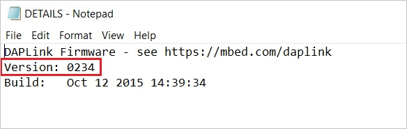

# Troubleshooting Downloads with WebUSB

Step 1: Check your cable

Make sure that your micro:bit is connected to your computer with a micr SB cable. You should see a **MICROBIT** driver appear in Window xplorer when it’s connected.

If you can see the MICROBIT driver, go to step 2.

If you can’t see the driver:

- Make sure that the USB cable is working. \>Does the cable work o  another computer? If not, find a different cable to use. Some cable  may only provide a power connection and don’t actually transfer data.

- Try another USB port on your computer.

Is the cable good but you still can’t see the **MICROBIT** driver? Yo ight have a problem with your micro:bit. Try the additional step escribed i he[（<https://support.microbit.org/support/solutions/articles/19000024000-fault-finding-with-a-micro-bit>）](\l)pag t microbit.org. If this doesn’t help, you can create(
[<u>https://support.microbit.org/support/tickets/new</u>](https://support.microbit.org/support/tickets/new)）t otify the Micro:bit Foundation of the problem. **Skip the rest of thes teps**.

Step 2: Check your firmware version

It’s possible that the firmware version on the micro:bit needs a pdate. Let’s check:

1.  Go to the **MICROBIT** driver.

2.  Open the **DETAILS.TXT** file.

3.  Look for a line in the file that says the version number. It shoul    say **Version:
    ...**

or **Interface Version: ...**

If the version is **0234**, **0241**, **0243** you **NEED** to updat he [firmware](https://makecode.microbit.org/device/firmware) on you icro:bit. Go to **Step 3** and follow the upgrade instructions.

If the version is **0249**, **0250** or higher, **you have the righ irmware** go to **step 4.**

Step 3: Update the firmware

1.  Put your micro:bit into **MAINTENANCE Mode**. To do this, unplug th    USB cable from the micro:bit and then re-connect the USB cable whil    you hold down the reset button. Once you insert the cable, you ca    release the reset button. You should now see a **MAINTENANCE**
    driver instead of the **MICROBIT** drive like before. Also, a yello    LED light will stay on next to the reset button.

2.  **Download the firmware .hex file**

(<https://microbit.org/guide/firmware/>)

3.Drag and drop that file onto the **MAINTENANCE** driver.

4\. The yellow LED will flash while the HEX file is copying. When th opy finishes, the LED will go off and the micro:bit resets. The
MAINTENANCE** drive now changes back to **MICROBIT.

5\. The upgrade is complete! You can open the **DETAILS.TXT** file t heck and see that the firmware version changed to the match the versio f the **HEX** file you copied.

If you want to know more about connecting the board, MAINTENANCE Mode nd upgrading the firmware, read about it i he（<https://microbit.org/guide/firmware/>).

Step 4: Check over version of Browser

WebUSB is a fairly new feature and may require you to update you rowser. Check that your browser version matches one of these:

- Chrome 65+ for Android, Chrome OS, Linux, macOS and Windows 10.

Step 5: Pair device

Once you’ve updated the firmware, open the **Chrome Browser**, go to th ditor and click on **Pair Device** in the gearwheel menu. See WebUSB（/
device / usb / webusb）for pairing instructions ink；[<u>https://microbit.org/get-started/user-guide/web-usb/</u>](https://microbit.org/get-started/user-guide/web-usb/ )
。

Enjoy fast downloads!

