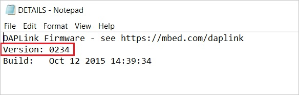

Troubleshooting Downloads with WebUSB
=====================================

**Step 1: Check your cable**

Make sure that your micro:bit is connected to your computer with a micro
USB cable. You should see a **MICROBIT** driver appear in Windows
Explorer when it’s connected.

|image1|

**If you can see the MICROBIT driver, go to step 2.**

If you can’t see the driver:

- Make sure that the USB cable is working. Does the cable work on
  another computer? If not, find a different cable to use. Some cables
  may only provide a power connection and don’t actually transfer data.

- Try another USB port on your computer.

Is the cable good but you still can’t see the **MICROBIT** driver? You
might have a problem with your micro:bit. Try the additional steps
described in
the（\ https://support.microbit.org/support/solutions/articles/19000024000-fault-finding-with-a-micro-bit)page
at microbit.org. If this doesn’t help, you can
create(https://support.microbit.org/support/tickets/new)to notify the
Micro:bit Foundation of the problem. **Skip the rest of these steps**.

**Step 2: Check your firmware version**

It’s possible that the firmware version on the micro:bit needs an
update. Let’s check:

1. Go to the **MICROBIT** driver.

2. Open the **DETAILS.TXT** file.

|image2|

3. Look for a line in the file that says the version number. It should
   say **Version:...**

|image3|

or **Interface Version: ...**

|image4|

If the version is **0234**, **0241**, **0243** you **NEED** to update
the firmware on your micro:bit. Go to **Step 3** and follow the upgrade
instructions.

If the version is **0249**, **0250** or higher, **you have the right
firmware** go to **step 4**.

**Step 3: Update the firmware**

1. Put your micro:bit into **MAINTENANCE** Mode. To do this, unplug the
   USB cable from the micro:bit and then re-connect the USB cable while
   you hold down the reset button. Once you insert the cable, you can
   release the reset button. You should now see a **MAINTENANCE** driver
   instead of the **MICROBIT** drive like before. Also, a yellow LED
   light will stay on next to the reset button.

|image5|

2. **Download the firmware .hex file**

(https://microbit.org/guide/firmware/)

We install different firmwares according to micro:bit board models. Here
it is Firmware for V2.20_V2.21.

|Img|

3. Drag and drop that file onto the **MAINTENANCE** driver.

4. The yellow LED will flash while the HEX file is copying. When the
copy finishes, the LED will go off and the micro:bit resets. The
**MAINTENANCE** drive now changes back to **MICROBIT**.

5. The upgrade is complete! You can open the **DETAILS.TXT** file to
check and see that the firmware version changed to the match the version
of the HEX file you copied.

If you want to know more about connecting the board, **MAINTENANCE**
Mode, and upgrading the firmware, read about it in
the(https://microbit.org/guide/firmware/).

**Step 4: Check over version of Browser**

WebUSB is a fairly new feature and may require you to update your
browser. Check that your browser version matches one of these:

- Chrome 65+ for Android, Chrome OS, Linux, macOS and Windows 10.

**Step 5: Pair device**

Once you’ve updated the firmware, open the **Chrome Browser**, go to the
editor and click on **Pair Device** in the gearwheel menu. See WebUSB（/
device / usb / webusb）for pairing instructions.
Link；\ https://microbit.org/get-started/user-guide/web-usb/ 。

Enjoy fast downloads!

.. |image1| image:: media/b1.png

.. |image3| image:: media/b3.jpeg

.. |image5| image:: media/b5.png

