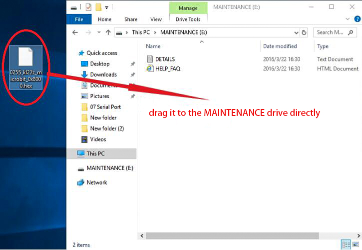

Troubleshooting-MAINTENANCE Mode
================================

Recently, many users encounter the issue that Micro:bit board doesn’t
respond when connected to the computer.

If the way you operate is correct, maybe you accidentally press the
reset button and enter the Maintenance mode or lead to lose the firmware
due to misoperation.

Plug in Micro:bit board, the“\ **MAINTENANCE**\ ”driver appears. That
means the program can’t be downloaded.

|image1|

**Note:**

1. Download the hexadecimal file from this page to your computer.

Link for the latest Micro: Bit firmware -0255:

https://www.microbit.org/get-started/user-guide/firmware/

2. After the latest firmware is downloaded, then drag it into the
“MAINTENANCE”driver as follows, which makes Micro:bit come back to
normal mode.

|image2|

**How to avoid entering“MAINTENANCE”mode?**

Make sure the Reset button is not pressed when plugging the board via an
USB cable.

|image3|

2. Don't unplug the cable suddenly during downloading micro:bit program,
otherwise, the firmware will be lost and enter in“MAINTENANCE”mode .

3. In the experiment, wrong wiring also cause short circuit or losing
the firmware

.. |image1| image:: media/a1.png

.. |image3| image:: media/a3.png
