Obtain Resources (**Important**)
================================

**Download (Important)**\ ：

[Important Resources](./Important Resources.7z)

**Special reminder:** After downloading Important Resources file,
extract it. The folder includes Python Code and Makecode Code,
microPython Libraries, Microbit driver, the initialization code for the
Servo Angle, Android APP, etc.

Pay special attention
=====================

1. This product contains small parts. Do not swallow.

2. Do not allow children under 3 years of age to play with or near this
product. .  3. Do not allow children who lack safety capabilities to use
this product without parental supervision. 

4. Do not use this product or its components near any AC power sockets
or other circuits to avoid the risk of electric shock. 

5. Do not use in the vicinity of liquid or fire.

6. Keep conductive material refrain from the product

7. Do not store or use the product under extreme conditions such as high
or low temperature and high humidity. 

8. Please turn off the circuit when leaving or not using the product.

9. Do not touch any moving or rotating parts of the product when
operating the product. 

10. It is normal that parts of the product may become hot when used in
certain circuit designs.  Improper handling may result in overheating. 

11. Failure to use the product in accordance with specifications may
damage the product.

Product Introduction
====================

|image1|

Have you wondered to learn programming or have your own programmin obot?
Nowadays, programming has developed to a lower age group, and i ill be a
trend for everyone thanks to the spread of simple graphica rogramming
platforms, from Have you wondered to learn programming or have your own
programming robot? Nowadays, programming has developed to a lower age
group, and it will be a trend for everyone thanks to the spread of
simple graphical programming platforms, from micro:bit to Arduino and
Raspberry Pi. Maybe you haven't heard of them before. However, with the
help of this product and tutorial, you can easily install a
multi-functional programming car and experience the fun of being a
maker.

Micro:bit is a highly integrated microcontroller with powerful functions
and small size. It is very suitable to be applied in STEAM education for
its functions to make robots, wearable devices and electronic
interactive games via the combination of code programming and graphical
programming.

This Keyestudio 4WD Mecanum Robot Car V2.0 is a smart DIY car dedicated
to micro:bit. The smart car consists of a car body with extended
functions, a PCB base plate with integrated motor drive sensors, 4
decelerating DC motors, Mecanum wheels, various modules and sensors as
well as acrylic boards. Therefore, you can easily assemble a cool
Mecanum wheel 4WD smart car by yourself，and then use Microsoft's online
graphical programming platform Make Code to program the micro:bit
control board to control the car. In the process, you can not only
experience the fun of creation but enhance hands-on ability and learn
programming skills as well.

MakeCode for micro:bit is the most widely used graphical programming
environment on the micro:bit official website. It is based on the
graphical programming environment developed by Microsoft's open source
project MakeCode. This graphical programming can also be converted to
code languages, python and javascript language, making it more
accessible to learn programming. At the same time, MakeCode programming
can be simulated or programmed for actual electronic components.

For your convenience, source code has been provided in every project, as
well as code programming steps and code explanation in details. Hope you
can better understand them.

Product Description
===================

This product is a smart car based on Micro:bit. It integrates a host of
functions such as ultrasonic following, line tracking, infrared control
as well as Bluetooth control. There is a passive buzzer to play music, 4
WS2812RGB LEDs to display different colors, 2 seven-color lights to make
direction lights for the car. This product uses two 18650 lithium
batteries for power supply.

When installing and disassembling the battery, please pay attention to
the positive and negative poles of the battery, and be sure not to
reverse them. By the way, the motor speed of this product is adjustable.

In order to provide you with better experience, corresponding documents
about installation and test code are also provided.

Product Parameters
==================

- Connector port input: DC 6V---9V

- Operating voltage of driver board system: 5V

- Standard operating power consumption: about 2.2W

- Maximum power: 12W

- Motor speed: 200RPM

- Working temperature range: 0-50℃

- Size: 120*120*120mm

- Environmental protection attributes: ROHS

**Note:** The working voltage of micro:bit is 3.3V, and the driver shiel
ntegrates a 3.3V/5V communication conversion circuit.

Product Kit list
================

== ========= =========================================== ===
#  Picture   Name                                        QTY
== ========= =========================================== ===
1  |image2|  Acrylic Board T=3mm                         1
2  |image3|  Acrylic Board with Lego Holes T=3mm         1
3  |image4|  Motor Plate                                 4
4  |image5|  Motor                                       4
5  |image6|  23\ *15*\ 5MM Fixing Board                  4
6  |image7|  Servo                                       1
7  |image8|  Mecanum Wheels (A direction)                2
8  |image9|  Mecanum Wheels (B direction)                2
9  |image10| keyestudio Micro：bit Expansion Board       1
10 |image11| micro:bit V2.0 Mainboard（KS4034、KS4034F） 1
11 |image12| Keyestudio Mecanum Car Lower Plate          1
12 |image13| M3*20MM Dual-pass Copper Pillar             4
13 |image14| 4265c Lego Part                             4
14 |image15| 43093 Lego Part                             4
15 |image16| Acrylic Gasket                              1
16 |image17| M3*6MM Flat Head Screw                      10
17 |image18| HC-SR04 Ultrasonic Sensor                   1
18 |image19| M3*8MM Flat Head Screw                      10
19 |image20| M3 Nickle-plated Nut                        10
20 |Img|     M3*30MM Round Head Screw                    9
21 |image21| M2 Nickle-plated Nut                        3
22 |image22| M2*8MM Round Head Screw                     3
23 |image23| M1.4 Nickle-plated Nut                      6
24 |image24| M1.4*10MM Round Head Screw                  6
25 |image25| M2.5*14MM Round Head Screw                  4
26 |image26| Remote Control                              1
27 |image27| Plastic String 3*100MM                      5
28 |image28| USB Cable                                   1
29 |image29| HX2.54 2P DuPont Wire100mm                  1
30 |image30| XH2.54 5P DuPont Wire100mm                  1
31 |image31| HX2.54 4P DuPont Wire 50mm                  1
32 |image32| HX2.54mm 4P to 2.54 F-F DuPont Wire 150mm   1
33 |image33| XH2.54 3P DuPont Wire 50mm                  2
34 |image34| 3*40MM Screwdriver                          1
35 |image35| TT Coupling                                 4
36 |image36| M1.2*5MM Round Head Self-tapping Screw      6
== ========= =========================================== ===

Preparations
============

BBC Micro:bit
-------------

**(1) What is Micro:bit?**

Micro:bit is an open source hardware platform based on the ARM
architecture launched by British Broadcasting Corporation (BBC) together
with ARM, Barclays, element14, Microsoft as well as other institutions.
The core device is a 32-bit Arm Cortex-M4 with FPU micro-processing.

It is just the size of a credit card but it's very powerful. The
Micro:bit main board is equipped with a host of components such as a 5*5
LED dot matrix, 2 programmable buttons, an accelerometer, a compass, a
thermometer, a touch-sensitive logo and a MEMS microphone, a Bluetooth
module of low energy as well as a buzzer and so on, making it empower to
play a variety of sounds without external devices.

Moreover, this board supports a sleeping mode to lower power consumption
of batteries and it can be entered if users long press the Reset & Power
button on the back of it.

Micro: Bit development board is easy to use and expand, the bottom gear
design of the gold finger can be used to interact with various
electronic components via fixed alligator clip. It is capable of reading
the data of sensors, controlling servos and RGB lights and inserting an
expansion board so as to connect various sensors.

Furthermore, it also supports a variety of codes and graphical
programming platforms, and is compatible with almost all PCs and mobile
devices and a free-installation driver. It has high integration
electronic modules and a serial port monitoring function for easy
debugging.

The board is widely used in programming video games, interactions
between light and sound, robots controls, scientific experiments,
wearable devices as well as some cool inventions like robots and musical
instruments.

**(2) Layout**

|image37|

For more information,please resort to following links:

https://tech.microbit.org/hardware/

https://microbit.org/new-microbit/

https://www.microbit.org/get-started/user-guide/overview/

https://microbit.org/get-started/user-guide/features-in-depth/

**(3) Pin out**

|image38|

**Functions:**

+----------------------------+----------------------------------------+
| GPIO                       | P0，P1，                               |
|                            | P2，P3，P4，P5，P6，P7，P8，P9，P10，  |
|                            | P11，P12，P13，P14，P15，P16，P19，P20 |
+----------------------------+----------------------------------------+
| ADC/DAC                    | P0，P1，P2，P3，P4，P10                |
+----------------------------+----------------------------------------+
| IIC                        | P19（SCL），P20（SDA）                 |
+----------------------------+----------------------------------------+
| SPI                        | P13（SCK），P14（MISO），P15（MOSI）   |
+----------------------------+----------------------------------------+
| PWM（used frequently）     | P0，P1，P2，P3，P4，P10                |
+----------------------------+----------------------------------------+
| PWM（not frequently used） | P5、P6、P7、P8、P9、                   |
|                            | P11、P12、P13、P14、P15、P16、P19、P20 |
+----------------------------+----------------------------------------+
| Occupied                   | P3(LED Col3)，P4(LED Col1)，P5(Button  |
|                            | A)，P6(LED Col4)，P7(LED               |
|                            | Col2)，P10(LED Col5)，P11(Button B)    |
+----------------------------+----------------------------------------+

Please browse the official website for mor
etails：\ https://tech.microbit.org/hardware/edgeconnector/

https://microbit.org/guide/hardware/pins/

**(4) Precautions for using Micro:bit motherboard:**

a. It is recommended to cover with a silicone protector to prevent short
circuit for its sophisticated electronic components.

b. Its IO port is very weak in driving since it can merely handle
current less than 300mA. Therefore, do not connect it with devices
operating in a large current, such as MG995 servo and DC motor or it
will get burnt. Furthermore, you must figure out the current
requirements of the devices before you use them and it is generally
recommended to use the board together with a Micro:bit expansion board.

c. It is recommended to power the main board via the USB interface or
the battery of 3V. The IO port of this board is 3V, so it does not
support sensors of 5V. If you need to connect sensors of 5 V, a Micro:
Bit expansion board is required.

d. When using pins(P3, P4, P6, P7 and P10)shared with the LED dot
matrix, blocking them from the matrix or the LEDs may display randomly
and the data about sensors connected maybe wrong.

e. Pin 19 and 20 can not be used as IO ports though the Makecode shows
they can. They can only be used as I2C communication.

f. The battery port of 3V cannot be connected with battery more than
3.3V or the main board will be damaged.

g. Forbid to operate it on metal products to avoid short circuit.

To put it simple, Micro:bit V2 main board is like a microcomputer, which
has made programming at our fingertips and enhanced digital innovation.
And as for programming environment, BBC provides a website:
https://microbit.org/code/, which has a graphical MakeCode program easy
for use.

To put it simple, Micro:bit V2 main board is like a microcomputer, which
has made programming at our fingertips and enhanced digital innovation.
And as for programming environment, BBC provides a website:
https://microbit.org/code/ ,which has a graphical MakeCode program easy
for use.

Install Micro:bit driver
------------------------

Micro: Bit can be installed without the USB driver. However, if your
computer fails to recognize the main board, you can install the diver
too. Just enter the file folder:

|image39|

First of all, connect the micro:bit to your computer using an US
able，then double-click |image40|\ to install.

|image41|

After downloading the driver, then click“Next”

|image42|

Click“Install” and “Finish”

|image43|

|image44|

Then click“Computer”—>“Properties”—>“Device manager”, as shown below.

|image45|

.. _assemble-mecanum-robot-:

Assemble Mecanum Robot 
=======================

It is a programmable car based on BBC micro:bit. It integrates a motor
driver, a line tracking sensor and an IR receiver into the base plate,
which also contains an ultrasonic sensor, a servo, 2 seven-color lights
as well as 4 WS2812 RGB lights. The wiring is not complicated and it has
Lego jacks to facilitate connection with other peripheral devices.
Abundant hardware resources will enable you to master more knowledge and
skills to create more technological inventions.

.. _sensors-and-control-pins-of-the-4wd-mecanum-robot-car-v20:

Sensors and control pins of the 4WD Mecanum Robot Car V2.0
----------------------------------------------------------

This car can help you to better learn how to use the Micro:bit and make
electronic knowledge accessible to you.

**Functions**

+-------+-------+-------+-------+-------+-------+-------+-------+-------+
| S     | S     | De    | Servo | Ultra | Line  | IR    | W     | Power |
| ensor | even- | celer |       | sonic | Tra   | Rec   | S2812 | s     |
|       | color | ating |       | s     | cking | eiver | RGB   | witch |
|       | light | DC    |       | ensor | S     |       | light |       |
|       |       | motor |       |       | ensor |       |       |       |
+-------+-------+-------+-------+-------+-------+-------+-------+-------+
| QTY   | 2     | 4     | 1     | 1     | 3     | 1     | 4     | 1     |
+-------+-------+-------+-------+-------+-------+-------+-------+-------+

**Note: the line tracking sensor, WS2812 RGB lights, IR receiver and
moto river are integrated in the base plate.**

**Pins：**

|image46|

**Power supply and Battery**

The keyestudio 4WD Mecanum Robot Car is powered by two 18650 batteries.
The battery holder of the car is compatible with any type of 18650
lithium battery (rechargeable). You can use a universal battery charger
to charge the 18650 lithium battery.

**Note:** This product does not contain batteries.

.. _the-installation-of-keyestudio-4wd-mecanum-robot-car-v20:

The Installation of Keyestudio 4WD Mecanum Robot Car V2.0
---------------------------------------------------------

Part 1
~~~~~~

**Components Needed:**

|image47|

**Installation Diagram:**

|image48|

**Prototype:**

|image49|

Part 2
~~~~~~

**Components Needed:**

|image50|

**Installation Diagram:**

|image51|

**Prototype:**

|image52|

Part 3
~~~~~~

**Components Needed:**

|image53|

**Installation Diagram:**

|image54|

**Prototype:**

|image55|

Part 4
~~~~~~

（adjust the angle of the servo first）

**Adjust the angle of the servo to 90 degrees.**

**Method 1：MakeCode code**

⚠️\ **Special note:** Before you write the code and upload it, you must
Understand the MakeCode IDE and add library files, please go to the the
link: `Get Started with
makecode <https://docs.keyestudio.com/projects/KS4034/en/latest/docs/Makecode/Makecode.html#get-started-with-makecode>`__

|image56|

The MakeCode code above is provided in the materials. Open the
adjustment code of the servo and burn it into the microbit motherboard
of the 4WD Mecanum Robot Car V2.0, and **power on via micro USB cable or
external power supply(turn the DIP switch to ON)**. That's it. The code
is at the following position as shown in the figure:

|image57|

**Method 2：Python code**

⚠️\ **Special note:** Before you write the code and upload it, you must
install the Mu IDE and add library files, please go to the the link:
`Get Started with
Python <https://docs.keyestudio.com/projects/KS4034/en/latest/docs/Python/Python.html#getting-started-with-python>`__

.. code:: Python

   # import microbit related libraries
   from microbit import *

   class Servo:
       def __init__(self, pin, freq=50, min_us=600, max_us=2400, angle=180):
           self.min_us = min_us
           self.max_us = max_us
           self.us = 0
           self.freq = freq
           self.angle = angle
           self.analog_period = 0
           self.pin = pin
           analog_period = round((1/self.freq) * 1000)  # hertz to miliseconds
           self.pin.set_analog_period(analog_period)

       def write_us(self, us):
           us = min(self.max_us, max(self.min_us, us))
           duty = round(us * 1024 * self.freq // 1000000)
           self.pin.write_analog(duty)
           sleep(100)
           self.pin.write_analog(0)

       def write_angle(self, degrees=None):
           if degrees is None:
               degrees = math.degrees(radians)
           degrees = degrees % 360
           total_range = self.max_us - self.min_us
           us = self.min_us + total_range * degrees // self.angle
           self.write_us(us)

   Servo(pin14).write_angle(90)
   sleep(1000)

The Python code above is provided in the materials. Open the adjustment
code of the servo and burn it into the microbit motherboard of the
4WD Mecanum Robot Car V2.0, and **power on via micro USB cable or
external power supply(turn the DIP switch to ON)**. That's it. The code
is at the following position as shown in the figure:

|image58|

**Components Needed:**

|image59|

Installation Diagram: (mind the installation direction)

|image60|

**Prototype:**

|image61|

Part 5
~~~~~~

**Components Needed:**

|image62|

**Installation Diagram:**

|image63|

**Prototype:**

|image64|

Part 6
~~~~~~

**Components Needed:**

|image65|

**Installation Diagram:**

|image66|

**Prototype:**

|image67|

Part 7
~~~~~~

**Components Needed:**

|image68|

**Installation Diagram:** (mind the direction of the motor)

|image69|

**Prototype:**

|image70|

Part 8
~~~~~~

**Components Needed:**

|image71|

**Installation Diagram:** (Pay attention to the installation direction
of the mecanum wheel)

|image72|

**Prototype:**

|image73|

Part 9
~~~~~~

**Components Needed:**

|image74|

**Installation Diagram:**

|image75|

**Prototype:**

|image76|

Part 10
~~~~~~~

**Components Needed:**

|image77|

**Installation Diagram:**

|image78|

**Prototype:**

|image79|

Wiring Diagram
~~~~~~~~~~~~~~

**The wiring of the servo:**

|image80|

|image81|

|image82|

**The wiring of the ultrasonic sensor:**

|image83|

|image84|

|image85|

**The wiring of the IR receiver module:**

|image86|

|image87|

**The wiring of the RGB:**

|image88|

|image89|

**The wiring of controlling the motor and seven-color light :**

|image90|

|image91|

**The wiring of controlling the 3-channel line-tracking sensor:**

|image92|

|image93|

**The wiring of the power supply:**

|image94|

**The corresponding interface of the motor:**

|image95|

**The installation of the battery:**

|image96|

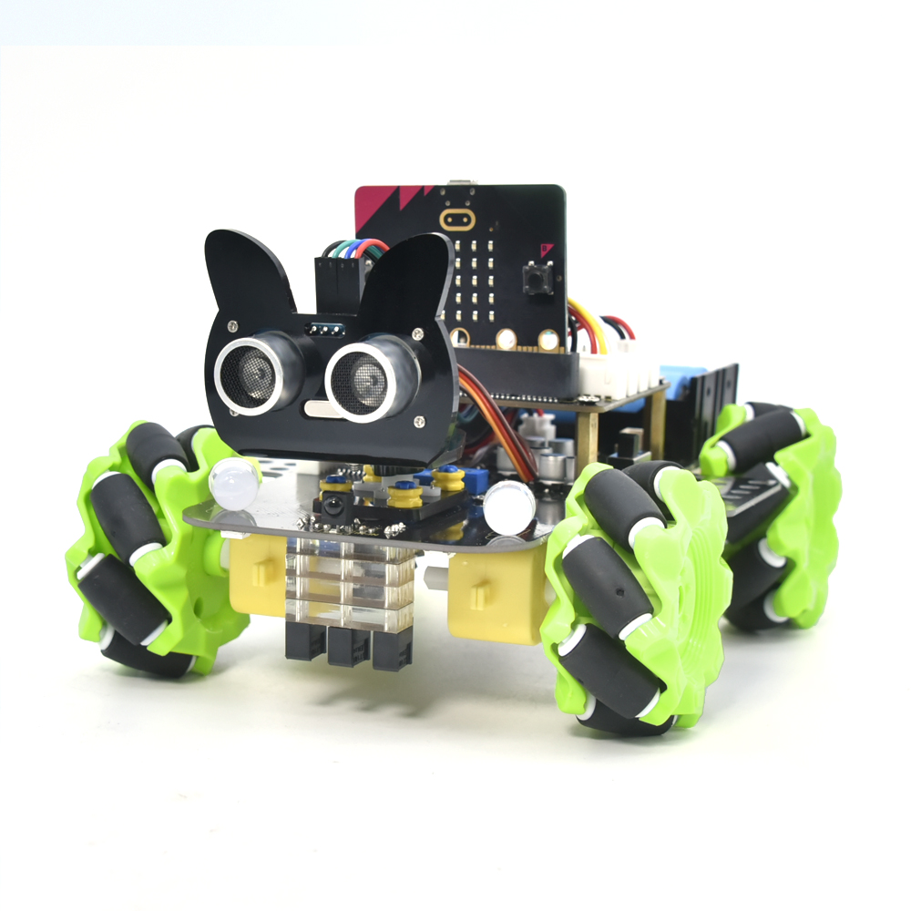
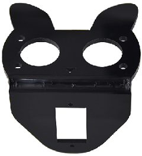
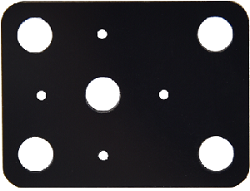
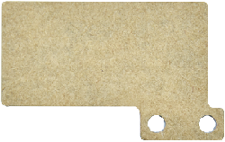
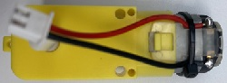
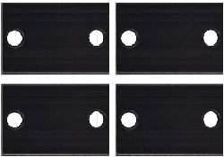
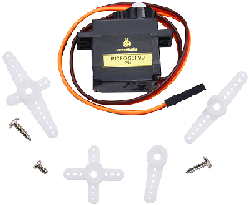
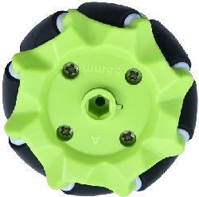
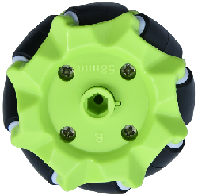
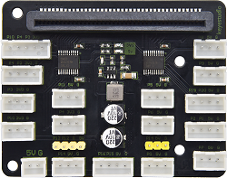
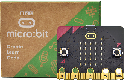
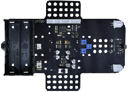
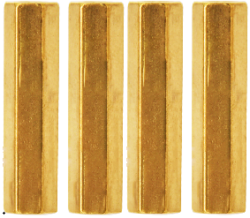
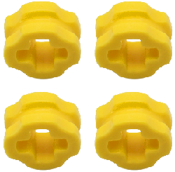
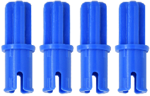
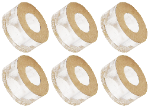
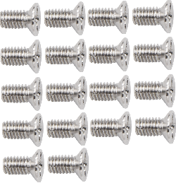
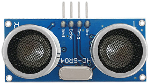
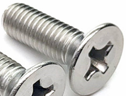
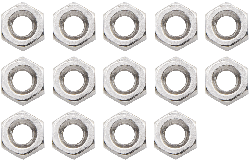
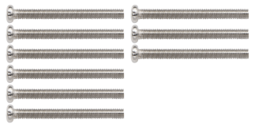
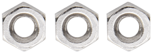
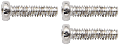

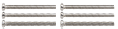
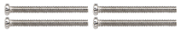

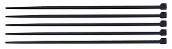
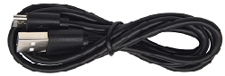
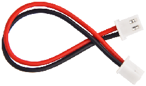
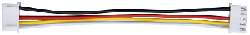
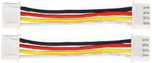
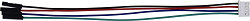
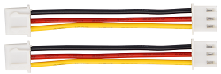
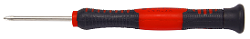
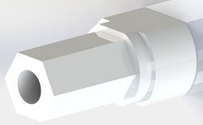
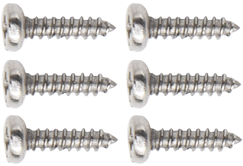
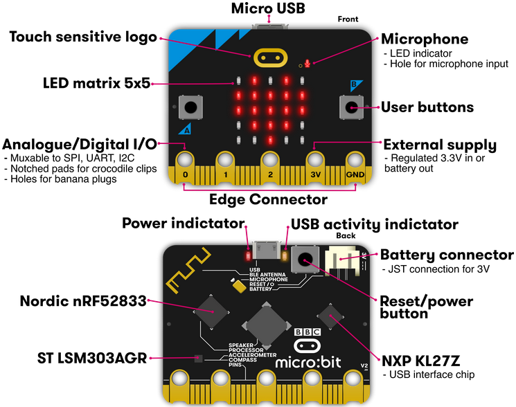
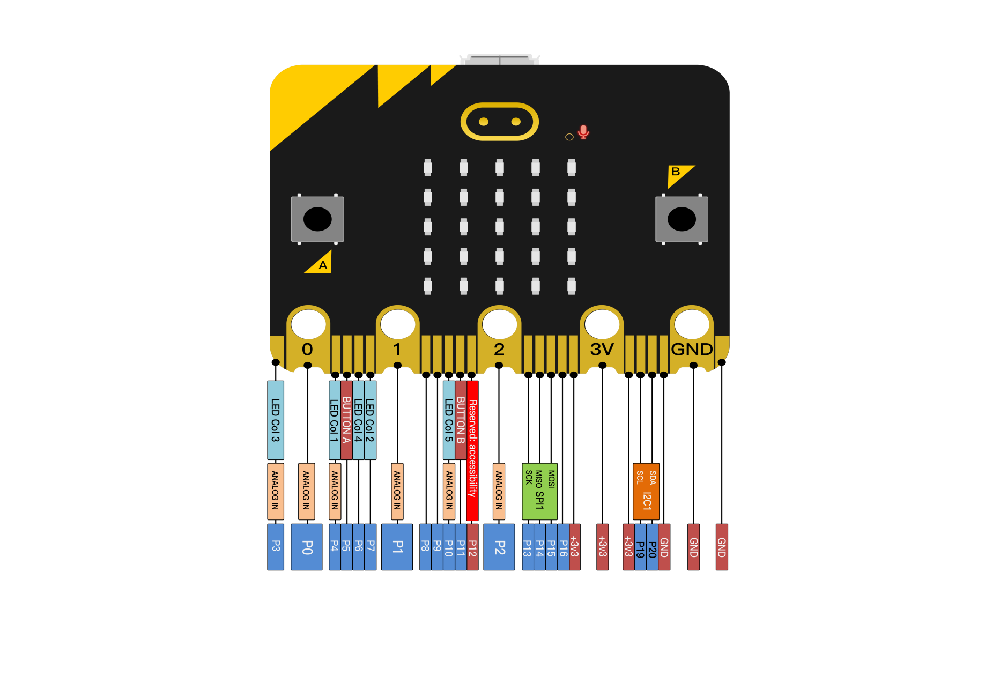
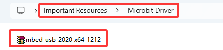
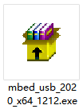
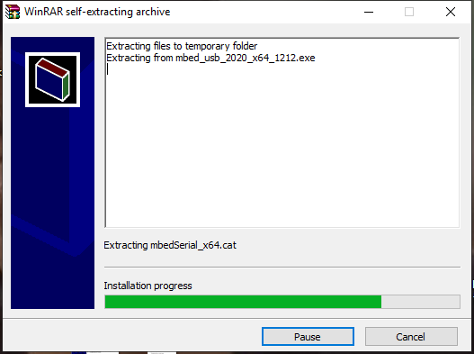
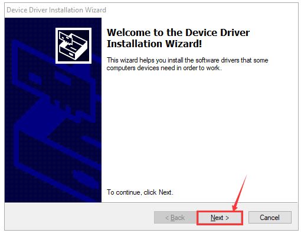
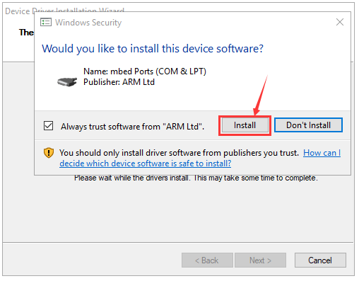
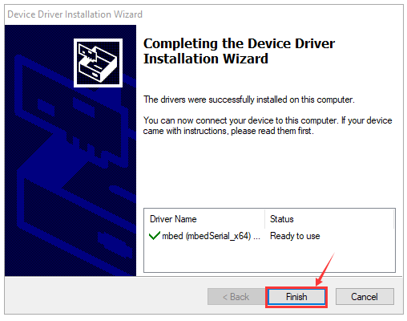
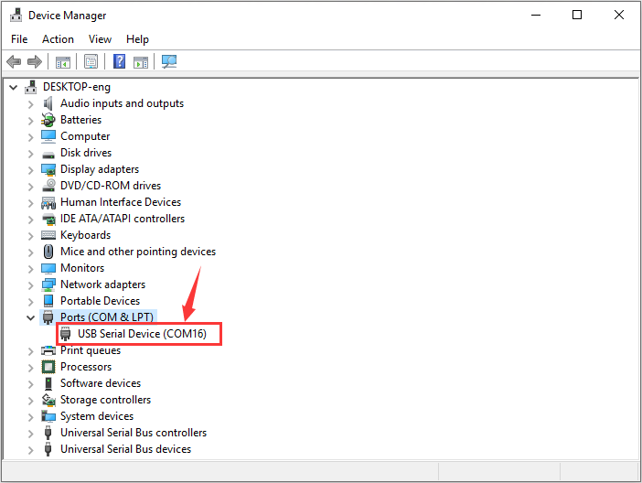
.. |image46| image:: ./media/img-20250509194238.png
.. |image47| image:: ./media/1359744ecc48217887f11b40a37613cb.png
.. |image48| image:: ./media/da34a7427322327e159917e26df7226b.png
.. |image49| image:: ./media/eb63f393313525edc39b87b783dcd35d.png
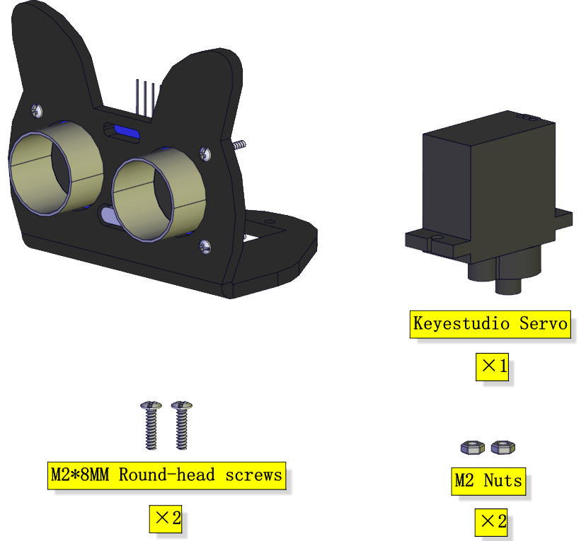
.. |image51| image:: ./media/2229a1ce94da8d7e51bbb8f21318bb95.png
.. |image52| image:: ./media/e1da364af78a75e7f9864dc09f37ffa5.png
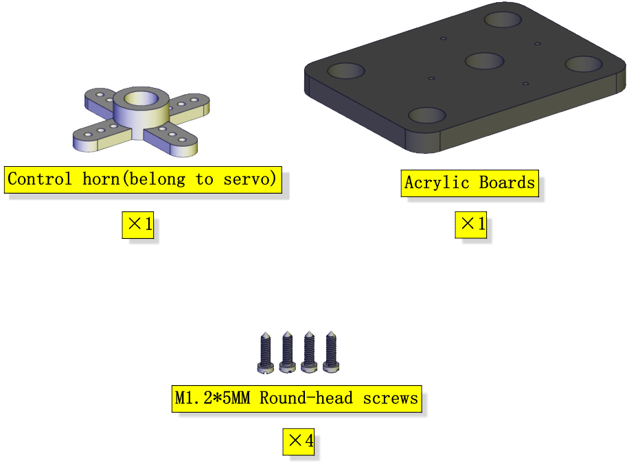
.. |image54| image:: ./media/6c3db02a45c93589a745b3f8cad3bd0a.png
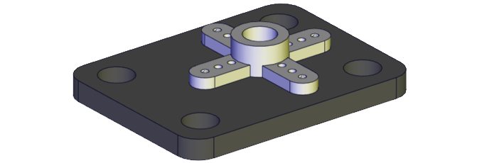
.. |image56| image:: ./media/a9ff633c21fba9a17a65ef93ead42737.png
.. |image57| image:: ./media/img-20250512084847.png
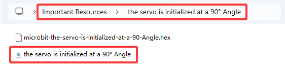
.. |image59| image:: ./media/b4e33f37a88612a44089f74c095e437e.png
.. |image60| image:: ./media/bc0039642dd6376b7583c633b2d1d04e.png
.. |image61| image:: ./media/0056985ba756f738e17f227e4695bcbd.png
.. |image62| image:: ./media/db9c2d3752d120f456f737fccb672de9.png
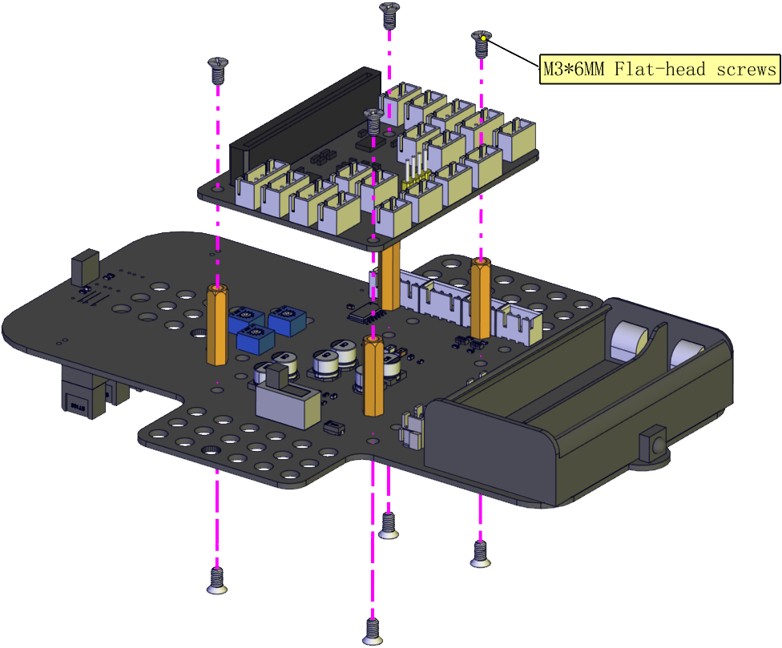
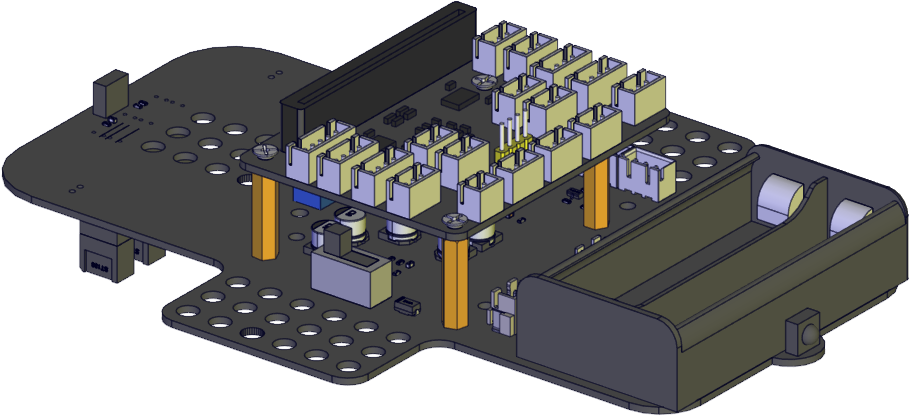
.. |image65| image:: ./media/724d85172f20eb4b56ef55d0ba0e9ad6.png

.. |image67| image:: ./media/97487f564f9a4c18d1f3d13c89853789.png
.. |image68| image:: ./media/c195d77d5d741224d6fa124e4b6c6326.png

.. |image70| image:: ./media/ba4a7baf56c25b99589b1ddfcac84558.png

.. |image74| image:: ./media/2c8e1a5e282bae1aab4e31c64f604d30.png

.. |image79| image:: ./media/3b463ff0fa12423a9ab13c57ecfcea01.png
.. |image80| image:: ./media/img-20250512094937.png

.. |image83| image:: ./media/img-20250512095021.png

.. |image86| image:: ./media/img-20250512095104.png

.. |image89| image:: ./media/30c00b0f22282cb7ebf49f23ac222093.jpg
.. |image90| image:: ./media/img-20250512095232.png
.. |image91| image:: ./media/8668b917a208eb67179fd8cb7ca4e5f0.jpg

.. |image95| image:: ./media/cb62d884d62581f7ed5c4d62e2c61cb0.jpg

