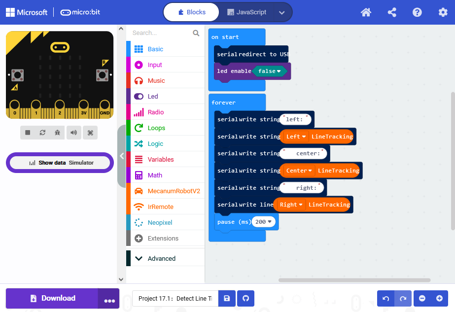
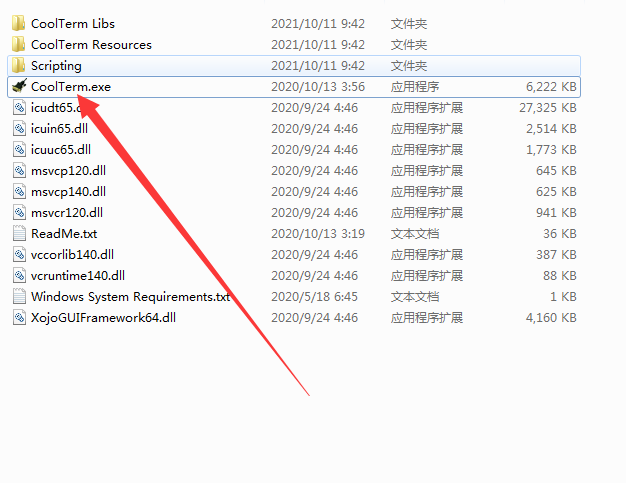
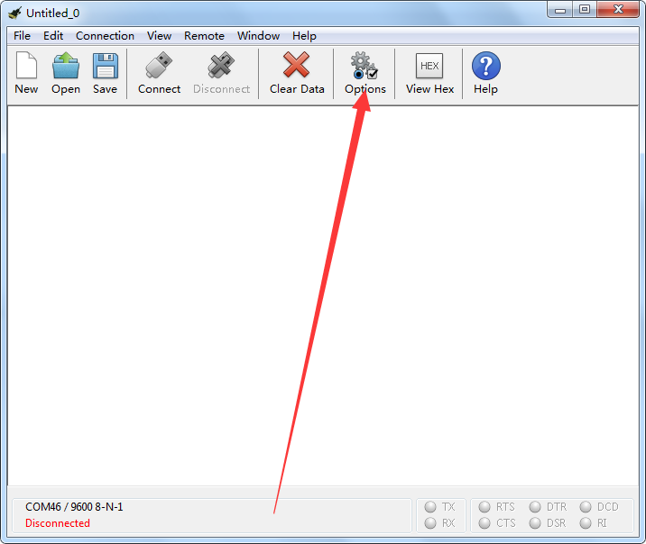
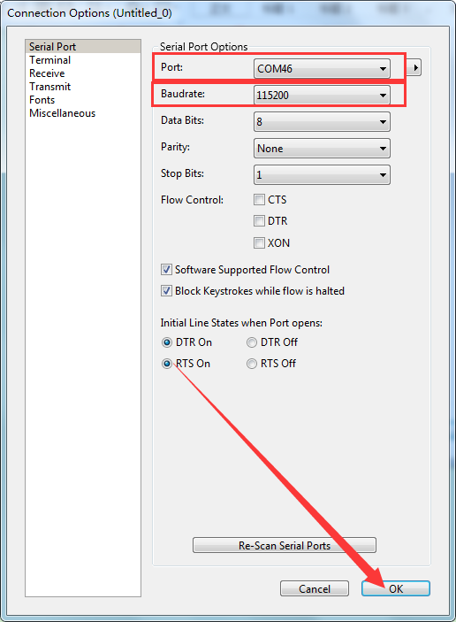
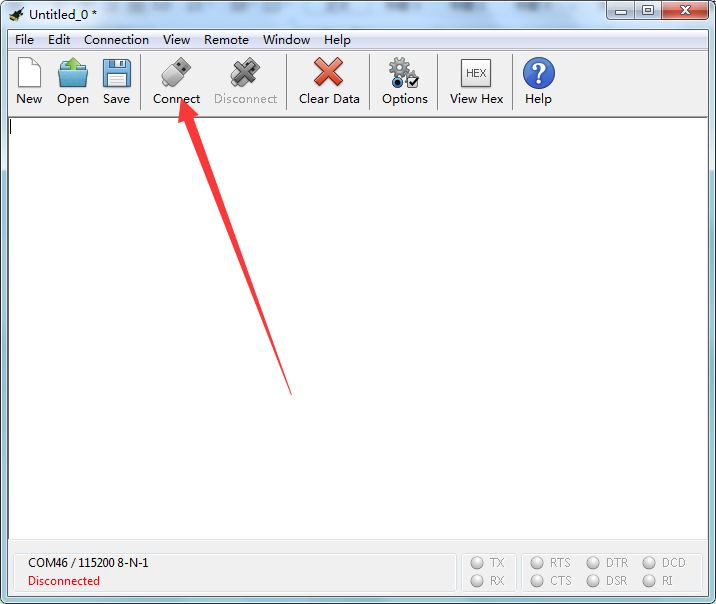
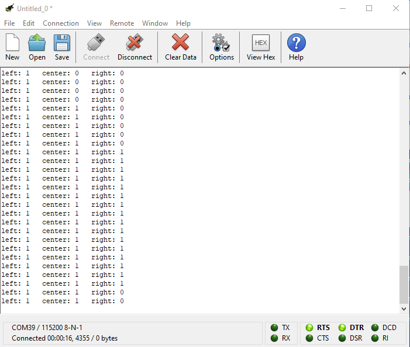

# micro bit Serial Port Tool Tutorial

Copy the Project 17.1: Detect Line Tracking Sensor. Hex file code to th icro Bit compiler, then download and upload to the Micro bit board. 

Open the Serial Port Tool

